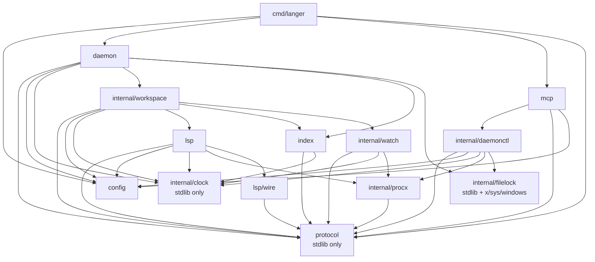

# langer — Architecture Contract (FROZEN, M3.5 AMENDED)

**Status:** FROZEN for v0.1 (milestones M1–M6), with the owner-approved M3
identity/indexing amendment of 2026-07-25 and M3.5 Windows-primary platform
amendment of 2026-07-26 incorporated.
**Authority:** `SPEC.md` v0.4 is authoritative. This document is subordinate to it.
Where this document adds something the spec does not state, it is marked
**[SPEC-ADDITION]** and listed in §11. Nothing here may override SPEC.md.
**Reconciled against:** the shipped, green M0 tree (2026-07-25).

Read this document plus `SPEC.md` and you should be able to build any single
package with no further questions. If you find a question this document does not
answer, that is a defect in this document — raise it, do not guess (PLAN ground
rule 1).

---

## 0. How this document was produced

Three independent architecture proposals were commissioned through different
lenses (A: testability & seams, B: concurrency & lifecycle, C: YAGNI / minimal
surface). This contract resolves them against each other **and against the code
M0 actually shipped**. Every conflict resolution is recorded in §10 with the
losing option named, so no implementer has to re-litigate a settled question.

Two rules governed the merge:

1. **Shipped M0 code wins** over any proposal, because it is green and its JSON
   shapes are pinned by tests against verbatim SPEC §4.4 JSON — *unless* it
   contradicts SPEC.md, in which case §9 records the required correction.
   (It does not: see §9.)
2. **`go.mod` is frozen.** Any proposal element requiring a new dependency was
   rejected on that basis alone. See §1.3.

**Verification performed before freezing.** Every Go declaration quoted in §3 was
read out of the shipped source files, not paraphrased. Every test name cited in
§3 was confirmed to exist in `protocol/types_test.go`,
`protocol/errors_test.go`, `config/config_test.go` and `cmd/langer/main_test.go`.
Every `testdata/README.md` section referenced (§1.8, §1.9, §3.3) was read and its
claim checked, including that
`~/.local/share/langer-devtools/ts5/node_modules/typescript/lib/tsserver.js`
exists on this machine. `go build ./...`, `go vet ./...`, `go test ./...` and
`gofmt -l .` were re-run green at freeze time.

---

## 1. Frozen decisions at a glance

### 1.1 Structure

| Decision | Value |
|---|---|
| Module | `github.com/fingerskier/langer`, Go 1.26.5 |
| Layout rule | Packages named by SPEC §10 live at the **repo root** (`protocol/`, `lsp/`, `index/`, `daemon/`, `mcp/`). Everything else lives under **`internal/`**. `config/` is a grandfathered root exception (shipped in M0). |
| Package count | 16 listed in §2.1: **4 shipped** (M0) + **12 to build** (M1–M4). M3.5 adds the shared `internal/filelock` platform seam; `internal/deps` is deleted by M4, so v0.1 ships **15**. No package may be added without an amendment to this document. |
| Import graph | Strictly layered, **acyclic** — proven in §2.3. |
| Test-only packages | `internal/testutil` only. No `pkg/`, no `lsptest`, no `memindex`, no `fakelsp` binary. |

### 1.2 Behaviour

| Question | Frozen answer | Source |
|---|---|---|
| Positions | 0-based lines, characters in **UTF-16 code units**. Converted in exactly one place: `lsp/wire`. | SPEC §4.3 |
| Paths on the wire | Workspace-relative, **slash-separated**, never absolute. | SPEC §4.4 |
| Errors | Every error crossing an IPC or MCP boundary is a `protocol.Error` with a SPEC §3.6 code. Convert with `protocol.AsError` at the boundary. | SPEC §3.6 |
| `NO_RESULT` | Lists return an **empty array with success**. `NO_RESULT` is returned only where "nothing" is not expressible: `get_hover` with no hover, `rename_symbol` with no edits. It travels in the `{"error":{…}}` envelope but **MCP `IsError` stays false** for it, because SPEC §3.6 says it is "not an error". | §10.7 |
| Diagnostic `code` | The language server's code rendered verbatim as a string: `"2339"` (TypeScript), `"reportAttributeAccessIssue"` (pyright). **No `TS` prefix is synthesised.** | §10.5 |
| Diagnostic `source` | Verbatim from the server, including case: `"typescript"`, `"Pyright"`. | §10.5 |
| `document_symbols` shape | **Flat list**; hierarchy is carried by the `container` string. No `children` field. | §10.4 |
| `possibly_stale` | A field of the **diagnostics result envelope**, not of an individual diagnostic. | §10.8 |
| MCP tool set | Exactly **12**: the nine ✅ SPEC §4.2 tools + `open_document`, `close_document`, `index_status` (PLAN M4). Never `reindex` or `list_language_servers`. | §5.10 |
| Repository namespace | Normalized path slug from system-Git `origin` (normally `<org>/<name>`, deeper namespaces preserved); canonical CLI-supplied workspace root, normally cwd, is the no-origin fallback. No network lookup. | SPEC §3.2, §10.14 |
| Cached symbol identity | `stable_key` remains descriptive/non-unique. References use workspace-scoped `symbol_key = repo_namespace + "\x1f" + definition_path + "\x1f" + stable_key`; residual same-file ambiguity goes live. | SPEC §5.2, §10.14 |
| Cache completeness | Hash-matching per-file rows only. Incomplete workspace/reference sets return `NOT_READY`, never partial success. | SPEC §3.4, §10.15 |
| Cached symbol search | Unicode-aware case-insensitive fuzzy order: exact, prefix, substring, boundary subsequence, general subsequence; apply the limit after ranking. | SPEC §4.2, §5.2 |
| Overlays live in | The **daemon**, not the MCP process. `session_id` therefore rides on every IPC request. | §10.9 |
| Overlay isolation | Achieved by **serialization** under a per-`(server, path)` lock, not by parallel state. A language server holds exactly one document state per URI. | §6.6 |
| Integration tests | Behind `//go:build integration`. `go test ./...` is fast and hermetic; `go test -tags=integration ./...` drives real language servers. Both must pass at every milestone gate. | §10.11 |

### 1.3 Dependencies — FROZEN, do not touch `go.mod`

Allowed (already in `go.mod`):

```
github.com/BurntSushi/toml            config          (in use, M0)
github.com/google/go-cmp              tests           (in use, M0)
github.com/fsnotify/fsnotify          internal/watch  (M3)
modernc.org/sqlite                    index           (M3)
github.com/modelcontextprotocol/go-sdk mcp            (M4)
golang.org/x/sys                     Windows APIs    (M3.5)
```

Rejected, with the stdlib replacement each implementer must use instead:

| Proposed | By | Rejected because | Use instead |
|---|---|---|---|
| `sourcegraph/jsonrpc2` | A | not in `go.mod`; B and C both hand-rolled framing anyway | `lsp/wire`: `bufio` + `encoding/json`, ~200 lines |
| `gofrs/flock` | B | not in `go.mod` | `syscall.Flock` + `O_CREAT\|O_EXCL` (stdlib) |
| `golang.org/x/sync` | B | present only as an indirect module; direct use needs a `go.mod` edit | buffered-channel semaphore (~10 lines) |
| `go.uber.org/goleak` | B | not in `go.mod` | `testutil.NoGoroutineLeaks(t)` (§5.10) |
| `go.lsp.dev/protocol` | all three | rejected unanimously | `lsp/wire` |
| `spf13/cobra` | all three | rejected unanimously; M0 already shipped stdlib `flag` | stdlib `flag` |
| any gitignore library | all three | rejected unanimously | `git ls-files --cached --others --exclude-standard`, spawned **through `internal/procx`**; denylist fallback for non-git roots |

If you believe a dependency is genuinely missing: **STOP and report it.** Do not
edit `go.mod` or `go.sum`.

---

## 2. Package layout

### 2.1 The packages

| # | Package | Milestone | One-line responsibility |
|---|---|---|---|
| 1 | `protocol/` | M0 (M2 extends) | Shared domain vocabulary: SPEC §4.4 result shapes, the SPEC §3.6 error model, the SPEC §3.5 daemon method surface, and the newline-delimited JSON IPC codec. Stdlib only. |
| 2 | `config/` | M0 (M1 extends) | SPEC §6 configuration: TOML load, XDG paths, env overrides, and the declarative language-server registry. |
| 3 | `cmd/langer/` | M0 (M2/M4 fill stubs) | `package main`: the three SPEC §10 subcommands, signal handling, slog-to-stderr, and dependency wiring. No business logic. |
| 4 | `internal/deps/` | M0 (deleted by M4) | Blank imports that stop `go mod tidy` dropping not-yet-used dependencies. Delete each line when its real importer lands. |
| 5 | `internal/clock/` | M1 | The `Clock`/`Timer` seam plus a deterministic `Fake`. Every spec'd deadline routes through it: sunset, overlay TTL, settle window, restart backoff, GC lease. |
| 6 | `internal/procx/` | M1 (M6 hardens) | The **only** package permitted to import `os/exec`. Enforces SPEC §9 (never execute workspace-local binaries) and owns process groups so language-server grandchildren cannot leak. |
| 7 | `lsp/wire/` | M1 | Pure LSP wire types, Content-Length framing, union decoders, UTF-16↔UTF-8 conversion, and normalisation into `protocol` types. No goroutines, no I/O beyond an `io.ReadWriter`. |
| 8 | `lsp/` | M1 | One live language server: initialize/capabilities, document state, diagnostics settle, crash detection, exponential-backoff restart, resync. |
| 9 | `index/` | M3 | SPEC §5 SQLite index: schema, migrations, the single shared driver module (WAL, `busy_timeout`, read pool + single writer), workspace-scoped symbol-key references, cache-kill-on-change, GC under a `meta` lease. |
| 10 | `internal/watch/` | M3 | SPEC §3.4 indexing scope (the project-files-only predicate + content hashing) and the debounced fsnotify watcher. One definition of "project file", shared by scanner and watcher. |
| 11 | `internal/workspace/` | M2 (M3/M5 extend) | The per-workspace actor and semantic brain: index-vs-live decision, cache-kill-on-change, capability→`UNSUPPORTED` gating, speculative overlays, `edit_token` minting and verification. |
| 12 | `daemon/` | M2 (M3/M6 extend) | The long-running process: local IPC server, single-instance locks, idle-sunset actor, session registry, GC scheduler, shutdown ordering. Owns no semantics. |
| 13 | `internal/daemonctl/` | M2 | Client-side auto-start and dial (SPEC §3.1). Runs **in the MCP process**; deliberately cannot reach daemon state. |
| 14 | `mcp/` | M4 (M5 extends) | The nine v0.1 tools over the MCP SDK: argument structs, SPEC §4.4 result envelopes, error-envelope discipline, session-ID mapping. |
| 15 | `internal/testutil/` | M1 | Test-only: hermetic XDG env, fixture paths, integration-server locator with `t.Skip`, goroutine-leak assertion. No non-test package may import it. |
| 16 | `internal/filelock/` | M3.5 | Cross-platform non-blocking advisory file locks shared by daemon liveness and client spawn coordination: `flock` on Unix, `LockFileEx` on Windows. |

`testdata/` is not a Go package: it holds the TS and Python fixtures, their
686-line README of measured expectations, and the M6 security tripwire.

### 2.2 Dependency direction

Arrows point **from importer to imported**. There is no arrow in the reverse
direction anywhere in this graph.



`protocol` and `internal/clock` are sinks: they import nothing from this module.
`cmd/langer` is the only source with no importer.

`config/` currently imports only the standard library and `BurntSushi/toml`. It
sits at layer 1 and *may* import `protocol` (§2.3), but nothing requires it to
and no edge is drawn for a dependency that does not exist. The §4.1 fields M1
adds do not change this.

### 2.3 Acyclicity

Assign each package a layer. An import is legal only if it goes to a
**strictly lower** layer. Since every legal edge strictly decreases the layer
number, no cycle can exist. **The graph is acyclic.**

| Layer | Packages | May import |
|---|---|---|
| 0 | `protocol`, `internal/clock` | stdlib only |
| 1 | `config`, `internal/procx`, `internal/filelock`, `lsp/wire` | layer 0 |
| 2 | `lsp`, `index`, `internal/watch` | layers 0–1 |
| 3 | `internal/workspace` | layers 0–2 |
| 4 | `daemon`, `internal/daemonctl` | layers 0–3 |
| 5 | `mcp` | layers 0–4, **but never `daemon`, `internal/workspace`, `lsp`, or `index`** |
| 6 | `cmd/langer` | anything |

Two packages are outside the layering because nothing in a shipped binary
imports them: `internal/deps` (blank imports only; imported by nothing; deleted
in M4) and `internal/testutil` (test-only; imports `config` and
`internal/clock`; **no non-test file anywhere may import it**).

Four import rules are **mechanically enforced by tests** (M1 writes rules 2
and 4; M3 appends rules 1 and 3):

1. Nothing outside `index/` imports `modernc.org/sqlite`. *(SPEC §3.2 names the
   single shared driver module as the seam where a write-broker could later be
   inserted; the import graph is what keeps that seam real.)*
2. Nothing outside `internal/procx/` imports `os/exec`. *(SPEC §9 security
   boundary — including the `git ls-files` spawn in `internal/watch`.)*
3. Nothing outside `internal/watch/` imports `github.com/fsnotify/fsnotify`.
4. `mcp/` does not import `daemon/`, `internal/workspace/`, `lsp/`, or `index/`.
   *(Keeps the process boundary honest and the tool surface unit-testable with
   no daemon, no socket and no language server.)*

**Home of the rule test: `cmd/langer/archrules_test.go`.** M1 creates it with
rules 2 and 4; M3 appends rules 1 and 3. `cmd/langer` is the right host because
it is the only package that legitimately depends on the whole tree, and it
already exists.

Implementation: walk the repo with `go/parser` in `ImportsOnly` mode, collect
each file's import paths keyed by directory, and assert the rules. Do **not**
reach for `golang.org/x/tools/go/packages` — it is not a permitted dependency
(§1.3) — and do not shell out, which would need `os/exec` and violate rule 2 in
the act of testing it.

---

## 3. Shared domain types — as they ACTUALLY exist

Everything in this section is **verbatim from the shipped M0 tree**. These
shapes are pinned by `protocol/types_test.go` (`TestSpecResultShapes`,
`TestSpecResultShapesRoundTrip`, `TestOptionalFieldsOmitted`) against JSON
copied literally out of SPEC §4.4, and by `protocol/errors_test.go`
(`TestErrorCodesMatchSpec`) against the SPEC §3.6 table in both directions.

**Changing a JSON tag in this section breaks the spec, not the test.**

### 3.1 `protocol/types.go`

```go
// Position is a 0-based location inside a document. Character is an offset in
// UTF-16 code units, matching the LSP default (SPEC §4.3).
type Position struct {
	Line      int `json:"line"`
	Character int `json:"character"`
}

// Range is a half-open span between two positions.
type Range struct {
	Start Position `json:"start"`
	End   Position `json:"end"`
}

// Location is the result shape of get_definition and get_references
// (SPEC §4.4). Path is workspace-relative.
type Location struct {
	Path         string `json:"path"`
	Range        Range  `json:"range"`
	IsDefinition bool   `json:"is_definition"`
	Preview      string `json:"preview,omitempty"`
}

// Hover is the result shape of get_hover (SPEC §4.4).
type Hover struct {
	Contents      string `json:"contents"`
	Documentation string `json:"documentation,omitempty"`
	Range         *Range `json:"range,omitempty"`
}

// Symbol is the result shape of document_symbols and workspace_symbols
// (SPEC §4.4).
type Symbol struct {
	Name      string     `json:"name"`
	Kind      SymbolKind `json:"kind"`
	Container string     `json:"container,omitempty"`
	Path      string     `json:"path"`
	Range     Range      `json:"range"`
	Detail    string     `json:"detail,omitempty"`
}

// Diagnostic is the result shape of get_diagnostics (SPEC §4.4).
type Diagnostic struct {
	Path     string   `json:"path"`
	Severity Severity `json:"severity"`
	Code     string   `json:"code,omitempty"`
	Source   string   `json:"source,omitempty"`
	Message  string   `json:"message"`
	Range    Range    `json:"range"`
}

type SymbolKind string   // "function", "class", … 26 values + "unknown"
type Severity   string   // "error" | "warning" | "information" | "hint"

func SymbolKindFromLSP(kind int) SymbolKind // 1..26 → spelling; else "unknown"
func SeverityFromLSP(severity int) Severity // 2/3/4 → warning/information/hint; else "error"
```

Note `Symbol` has **no `Children` field** and `Diagnostic.Code` is a plain
`string`. Both are deliberate — see §10.4 and §10.5.

### 3.2 `protocol/errors.go`

```go
type ErrorCode string

const (
	ErrNotReady         ErrorCode = "NOT_READY"
	ErrUnsupported      ErrorCode = "UNSUPPORTED"
	ErrNoResult         ErrorCode = "NO_RESULT"
	ErrStaleEdit        ErrorCode = "STALE_EDIT"
	ErrWorkspaceUnknown ErrorCode = "WORKSPACE_UNKNOWN"
	ErrServerCrashed    ErrorCode = "SERVER_CRASHED"
	ErrInternal         ErrorCode = "INTERNAL"
)

var ErrorCodes []ErrorCode           // every valid code, SPEC §3.6 table order
func (c ErrorCode) Valid() bool

type Error struct {
	Code         ErrorCode `json:"code"`
	Message      string    `json:"message"`
	RetryAfterMS int       `json:"retry_after_ms,omitempty"`
}

type ErrorResult struct {
	Error *Error `json:"error"`
}

func NewError(code ErrorCode, message string) *Error
func NewErrorf(code ErrorCode, format string, args ...any) *Error
func (e *Error) WithRetryAfterMS(ms int) *Error
func (e *Error) Error() string          // "CODE: message"
func (e *Error) Result() ErrorResult
func AsError(err error) *Error          // nil→nil; structured (even wrapped) passes through; else INTERNAL
```

**`AsError` is the boundary rule.** Every handler that is about to write to a
socket or return an MCP result calls it. Nothing else may serialise an error.

### 3.3 `protocol/ipc.go`

```go
const Version = 1   // bumped on any wire-incompatible change

const (
	MethodOpenWorkspace  = "open_workspace"
	MethodCloseWorkspace = "close_workspace"
	MethodOpenDocument   = "open_document"
	MethodCloseDocument  = "close_document"
	MethodGetDefinition   = "get_definition"
	MethodGetReferences   = "get_references"
	MethodGetHover        = "get_hover"
	MethodDocumentSymbols = "document_symbols"
	MethodWorkspaceSymbol = "workspace_symbols"
	MethodGetDiagnostics  = "get_diagnostics"
	MethodRenameSymbol = "rename_symbol"
	MethodApplyEdit    = "apply_edit"
	MethodSimulateEdit = "simulate_edit"
	MethodIndexStatus  = "index_status"
)

type Request struct {
	Version int             `json:"version"`
	ID      int64           `json:"id"`
	Method  string          `json:"method"`
	Params  json.RawMessage `json:"params,omitempty"`
}

type Response struct {
	Version int             `json:"version"`
	ID      int64           `json:"id"`
	Result  json.RawMessage `json:"result,omitempty"`
	Error   *Error          `json:"error,omitempty"`
}

func NewRequest(id int64, method string, params json.RawMessage) *Request
func NewResponse(id int64, result any) (*Response, error)
func NewErrorResponse(id int64, err *Error) *Response
```

### 3.4 `config/config.go` (shipped surface)

```go
const (
	EnvConfigPath   = "LANGER_CONFIG_PATH"
	EnvDatabasePath = "LANGER_DB_PATH"
	EnvLogLevel     = "LANGER_LOG_LEVEL"
)

type LanguageServer struct {
	Name           string   `toml:"name"`
	Command        string   `toml:"command"`
	Args           []string `toml:"args"`
	FileExtensions []string `toml:"file_extensions"`
	RootMarkers    []string `toml:"root_markers"`
}

type Config struct {
	DatabasePath    string           `toml:"database_path"`
	SocketPath      string           `toml:"socket_path"`
	LogLevel        string           `toml:"log_level"`
	LanguageServers []LanguageServer `toml:"language_servers"`
}

func Load() (*Config, error)
func LoadFrom(path string) (*Config, error)
func ConfigPath() (string, error)
func DefaultConfigPath() (string, error)     // ~/.config/lsp-mcp/config.toml
func DefaultDatabasePath() (string, error)   // ~/.local/share/lsp-mcp/index.db
func DefaultSocketPath() (string, error)     // ~/.local/share/lsp-mcp/daemon.sock
func (c *Config) Validate() error
func (c *Config) LanguageServerForFile(path string) (LanguageServer, bool)
func (c *Config) LanguageServerByName(name string) (LanguageServer, bool)
```

Unknown TOML keys are a hard error (`toml.MetaData.Undecoded`). There are **no
built-in registry entries** — SPEC §9 requires that the daemon only ever execute
binaries the user explicitly configured, and `TestNoBuiltinLanguageServers`
guards it.

---

## 4. Contract extensions each milestone adds to `protocol/`

`protocol/` is the one package several milestones extend. To keep parallel
agents from colliding, each extension is a **new file** owned by exactly one
milestone (see §8).

### 4.1 M1 additions

M1 adds two registry fields to `config/` and two small type files to
`protocol/`. The `protocol/` files exist because M1's `lsp` package signatures
(§5.4) need `FileEdit` and `ServerStatus`, and M1 must not have to edit a file
owned by M2 (§8).

#### 4.1a `config/config.go` — the registry gap **[SPEC-ADDITION]**

`testdata/README.md` §1.9 proves, with a captured `initialize` failure, that
`typescript-language-server` 5.3.0 **cannot start** without
`initializationOptions.tsserver.path`. SPEC §6's example has no way to express
that, so M1 acceptance is impossible without this field.

```go
type LanguageServer struct {
	Name           string         `toml:"name"`
	Command        string         `toml:"command"`
	Args           []string       `toml:"args"`
	FileExtensions []string       `toml:"file_extensions"`
	RootMarkers    []string       `toml:"root_markers"`

	// InitializationOptions is passed verbatim as the LSP `initialize`
	// request's initializationOptions. [SPEC-ADDITION — see docs §11 item 1]
	InitializationOptions map[string]any `toml:"initialization_options"`

	// AllowWorkspaceLocal opts this entry in to executing a binary that
	// resolves inside the workspace tree. Defaults to false. SPEC §9's
	// "without explicit opt-in" wording authorises exactly this knob;
	// nothing in the v0.1 test suite or fixtures may ever set it true.
	AllowWorkspaceLocal bool `toml:"allow_workspace_local"`
}
```

Both fields are additive; `Validate` gains no new rules beyond rejecting an
`allow_workspace_local` with an empty `command`.

#### 4.1b `protocol/edit.go` and `protocol/status.go` — types M1's signatures need

These are **M1-owned files** (§8). M2's `params.go` references them and must not
redeclare them.

```go
// protocol/edit.go — a computed change. Ranges are 0-based UTF-16, like
// everything else on the wire.
type TextEdit struct {
	Range   Range  `json:"range"`
	NewText string `json:"new_text"`
}

type FileEdit struct {
	Path  string     `json:"path"`   // workspace-relative, slash-separated
	Edits []TextEdit `json:"edits"`
}
```

```go
// protocol/status.go — supervision and indexing state, surfaced by
// index_status (SPEC §3.5) and by lsp.Supervisor.Status (§5.4).
type IndexState string

const (
	IndexIdle     IndexState = "idle"
	IndexScanning IndexState = "scanning"
	IndexIndexing IndexState = "indexing"
	IndexReady    IndexState = "ready"
	IndexFailed   IndexState = "failed"
)

// ServerState is the SPEC §3.3 supervision state machine.
type ServerState string

const (
	ServerStopped  ServerState = "stopped"
	ServerStarting ServerState = "starting"
	ServerReady    ServerState = "ready"
	ServerCrashed  ServerState = "crashed"
	ServerBackoff  ServerState = "backoff"
)

type ServerStatus struct {
	Name         string      `json:"name"`
	State        ServerState `json:"state"`
	Restarts     int         `json:"restarts,omitempty"`
	// RetryAfterMS is the remaining backoff when State is ServerBackoff.
	RetryAfterMS int `json:"retry_after_ms,omitempty"`
}
```

### 4.2 M2 adds `protocol/service.go` — the SPEC §3.5 method surface

Identifiers and the daemon's Go-level method set. `SessionID` is on **every**
call: overlays cannot be isolated without it (§6.6), and the daemon must be able
to drop a dead client's state.

```go
package protocol

// WorkspaceID identifies an open workspace within a daemon (SPEC §3.5).
type WorkspaceID string

// SessionID identifies one MCP caller. It is derived from the MCP SDK's
// ServerSession.ID() in the frontend and scopes speculative overlays
// (SPEC §4.2).
type SessionID string

// Service is the SPEC §3.5 daemon API rendered in Go. It has exactly two
// implementations: daemon.Core (in-process, server side) and
// daemonctl.Client (over the socket, client side). mcp/ programs against
// this interface and therefore never imports daemon/.
//
// Every returned error MUST be convertible by AsError to a *Error carrying a
// SPEC §3.6 code. Return `error`, not `*Error`, so a nil pointer can never
// masquerade as a non-nil error.
type Service interface {
	OpenWorkspace(ctx context.Context, p OpenWorkspaceParams) (OpenWorkspaceResult, error)
	CloseWorkspace(ctx context.Context, p CloseWorkspaceParams) (EmptyResult, error)

	OpenDocument(ctx context.Context, p OpenDocumentParams) (EmptyResult, error)
	CloseDocument(ctx context.Context, p DocumentParams) (EmptyResult, error)

	GetDefinition(ctx context.Context, p PositionParams) (LocationsResult, error)
	GetReferences(ctx context.Context, p PositionParams) (LocationsResult, error)
	GetHover(ctx context.Context, p PositionParams) (HoverResult, error)
	DocumentSymbols(ctx context.Context, p DocumentParams) (SymbolsResult, error)
	WorkspaceSymbols(ctx context.Context, p WorkspaceSymbolsParams) (SymbolsResult, error)
	GetDiagnostics(ctx context.Context, p DiagnosticsParams) (DiagnosticsResult, error)

	RenameSymbol(ctx context.Context, p RenameParams) (EditPlanResult, error)
	ApplyEdit(ctx context.Context, p ApplyEditParams) (ApplyResult, error)
	SimulateEdit(ctx context.Context, p SimulateEditParams) (DiagnosticsResult, error)

	IndexStatus(ctx context.Context, p IndexStatusParams) (IndexStatusResult, error)

	// EndSession releases everything owned by a session: overlays, refcounted
	// open documents, workspace references. Called on explicit close AND on
	// transport disconnect, so it must be idempotent. Ending an unknown
	// session succeeds — it is not WORKSPACE_UNKNOWN.
	EndSession(ctx context.Context, p EndSessionParams) (EmptyResult, error)
}

// MethodEndSession is declared HERE, not in the M0-frozen protocol/ipc.go.
// SPEC §3.5's conceptual method list does not name it, but the daemon cannot
// honour SPEC §4.2's "overlays are dropped when the session disconnects"
// without it. [SPEC-ADDITION — see §11 item 7]
const MethodEndSession = "end_session"
```

**Every method has the same shape: `(ctx, Params) (Result, error)`.** That
uniformity is deliberate — it lets `daemon` dispatch by a table keyed on method
name and lets `daemonctl` marshal generically, instead of fourteen bespoke
round-trip functions. `EmptyResult` marshals to `{}`, which is a valid MCP
structured result; a bare `null` is not.

`protocol/ipc.go` stays exactly as M0 shipped it. New method-name constants go
in `protocol/service.go`.

### 4.3 M2 adds `protocol/params.go` — params and result envelopes

MCP requires a tool's structured result to be a **JSON object**, so
list-returning tools need a one-key wrapper that SPEC §4.4 does not name.
**[SPEC-ADDITION — see §11 item 2]** The element shapes inside are exactly the
frozen §3.1 types.

```go
package protocol

// ---- params ----

type OpenWorkspaceParams  struct { Session SessionID `json:"session_id"`; Root string `json:"root_path"` }
type CloseWorkspaceParams struct { Session SessionID `json:"session_id"`; Workspace WorkspaceID `json:"workspace_id"` }

type DocumentParams struct {
	Session   SessionID   `json:"session_id"`
	Workspace WorkspaceID `json:"workspace_id"`
	Path      string      `json:"path"`               // workspace-relative
}

type OpenDocumentParams struct {
	DocumentParams
	LanguageID string `json:"language_id,omitempty"`
}

type PositionParams struct {
	DocumentParams
	Position Position `json:"position"`
}

type WorkspaceSymbolsParams struct {
	Session   SessionID   `json:"session_id"`
	Workspace WorkspaceID `json:"workspace_id"`
	Query     string      `json:"query"`
	Limit     int         `json:"limit,omitempty"`    // 0 = server default (200)
}

type DiagnosticsParams struct {
	Session   SessionID   `json:"session_id"`
	Workspace WorkspaceID `json:"workspace_id"`
	Path      string      `json:"path,omitempty"`     // empty = whole workspace
}

type RenameParams      struct { PositionParams; NewName string `json:"new_name"` }
type ApplyEditParams   struct { Session SessionID `json:"session_id"`; Workspace WorkspaceID `json:"workspace_id"`; EditToken string `json:"edit_token"` }
type SimulateEditParams struct { DocumentParams; NewText string `json:"new_text"` }
type IndexStatusParams struct { Session SessionID `json:"session_id"`; Workspace WorkspaceID `json:"workspace_id"` }
type EndSessionParams  struct { Session SessionID `json:"session_id"` }

// ---- results ----
//
// Success envelopes carry payload ONLY. A failure is never expressed by a
// field inside these structs: it is the shipped ErrorResult, i.e. exactly
// {"error":{…}} and nothing else (SPEC §4.4).

type EmptyResult struct{}

type OpenWorkspaceResult struct {
	Workspace WorkspaceID `json:"workspace_id"`
	Root      string      `json:"root_path"`
}

type LocationsResult struct {
	Locations []Location `json:"locations"`
	Truncated bool       `json:"truncated,omitempty"`
}

type HoverResult struct {
	Hover *Hover `json:"hover"`
}

type SymbolsResult struct {
	Symbols   []Symbol `json:"symbols"`
	Truncated bool     `json:"truncated,omitempty"`
}

type DiagnosticsResult struct {
	Diagnostics   []Diagnostic `json:"diagnostics"`
	PossiblyStale bool         `json:"possibly_stale,omitempty"` // SPEC §4.3
}

// TextEdit and FileEdit are declared in protocol/edit.go, owned by M1 (§4.1b).

// EditPlanResult is the dry-run product of rename_symbol. EditToken embeds
// the content hash of every affected file; apply_edit verifies them against
// disk and rejects with STALE_EDIT on mismatch (SPEC §4.2).
type EditPlanResult struct {
	EditToken string     `json:"edit_token"`
	Files     []FileEdit `json:"files"`
}

type ApplyResult struct {
	Applied []string `json:"applied"`
}

type IndexStatusResult struct {
	Root            string         `json:"root_path"`
	State           IndexState     `json:"state"`
	FilesIndexed    int            `json:"files_indexed"`
	FilesTotal      int            `json:"files_total"`
	LanguageServers []ServerStatus `json:"language_servers,omitempty"`
	LastIndexedUnixMS int64        `json:"last_indexed_unix_ms,omitempty"`
	// Error is present iff State == IndexFailed. It is always a structured
	// SPEC §3.6 error; failure detail never leaks into a free-text state.
	Error *Error `json:"error,omitempty"`
}

// IndexState, ServerState and ServerStatus are declared in protocol/status.go,
// owned by M1 (§4.1b).
```

`Request` gains no new field: the session id lives inside every params struct,
so the shipped `protocol.Request` is unchanged.

### 4.4 M2 adds `protocol/codec.go` — the IPC framing

Newline-delimited JSON over any `io.ReadWriteCloser` (SPEC §3.5). Stdlib only.

```go
package protocol

// Codec frames Requests and Responses as newline-delimited JSON.
//
// Reads are called ONLY from a connection's single reader goroutine. Writes
// are safe for concurrent use: the implementation serialises them internally
// so two request handlers can never interleave frames on the wire.
type Codec struct{ /* unexported: bufio.Reader, io.Writer, sync.Mutex */ }

func NewCodec(rw io.ReadWriteCloser) *Codec

func (c *Codec) ReadRequest() (*Request, error)
func (c *Codec) ReadResponse() (*Response, error)
func (c *Codec) WriteRequest(r *Request) error     // safe for concurrent use
func (c *Codec) WriteResponse(r *Response) error   // safe for concurrent use
func (c *Codec) Close() error

// CheckVersion compares a peer's declared protocol version against Version.
// A mismatch yields an INTERNAL error whose message names both versions; the
// caller turns that into the SPEC §3.1 drain-and-restart.
func CheckVersion(peer int) *Error
```

A frame larger than 8 MiB is rejected with `INTERNAL` rather than buffered
without limit.

---

## 5. Package seams — the exact Go interfaces

Interfaces are declared in the package named in each heading. Concrete types are
returned, interfaces are accepted (standard Go). Every interface below exists
because a specific milestone test substitutes it or because it is a mandated
architectural seam; nothing here is speculative.

### 5.1 `internal/clock` (M1)

```go
package clock

// Clock is the only source of time in the tree. time.Now, time.After,
// time.Sleep and time.NewTimer are forbidden outside this package: the
// 30-minute sunset (SPEC §3.1), 5-minute overlay TTL (SPEC §4.2), ≤2s
// diagnostics settle window (SPEC §4.3) and restart backoff (SPEC §3.3)
// are all SPEC'd behaviour that must be asserted, not slept through.
type Clock interface {
	Now() time.Time
	NewTimer(d time.Duration) Timer
	NewTicker(d time.Duration) Ticker
	// Sleep blocks for d or until ctx is done, returning ctx.Err() if the
	// latter wins.
	Sleep(ctx context.Context, d time.Duration) error
	// After is shorthand for NewTimer(d).C(); the timer is reclaimed when it
	// fires. Do not use it in a loop.
	After(d time.Duration) <-chan time.Time
}

type Timer interface {
	C() <-chan time.Time
	Stop() bool
	Reset(d time.Duration) bool
}

type Ticker interface {
	C() <-chan time.Time
	Stop()
}

func New() Clock                       // real time

// Fake is a deterministic clock. Advance delivers every timer whose deadline
// has passed, in deadline order, BEFORE returning — so a test that advances
// 30 minutes can immediately assert that sunset fired.
type Fake struct{ /* … */ }
func NewFake(start time.Time) *Fake
func (f *Fake) Advance(d time.Duration)
func (f *Fake) BlockUntil(waiters int)  // wait for N goroutines to be parked on a timer
```

### 5.2 `internal/procx` (M1, hardened M6) — the SPEC §9 security boundary

```go
package procx

// Resolver decides which binary a registry entry actually runs. It is the
// single enforcement point for SPEC §9: opening a workspace must never
// execute a project-local binary.
//
// Resolve is PURE (no exec, no writes) so the invariant gets an exhaustive
// table test in M1 — every flavour of node_modules/.bin, vendor/, symlink
// escape, "." on PATH and relative-path trickery — in addition to the
// mandatory M6 end-to-end tripwire.
//
// Containment is decided AFTER filepath.EvalSymlinks on BOTH the candidate
// and the workspace root, and compared path-component-wise (never by string
// prefix, which would let "/repo-evil" pass a "/repo" check). On macOS the
// comparison is case-insensitive, because the filesystem is.
type Resolver interface {
	// Resolve returns the absolute path of the executable to run.
	// It returns an UNSUPPORTED *protocol.Error when the command cannot be
	// found, and an INTERNAL *protocol.Error naming the offending path when
	// the candidate resolves inside workspaceRoot and allowWorkspaceLocal
	// is false.
	//
	// PATH lookup MUST use a PATH scrubbed of every entry that resolves
	// inside workspaceRoot and of every relative entry (including "" and ".").
	Resolve(command, workspaceRoot string, allowWorkspaceLocal bool) (string, error)
}

// Runner spawns processes. It is the ONLY code in the tree permitted to
// import os/exec — including the `git ls-files` spawn in internal/watch.
type Runner interface {
	Start(ctx context.Context, spec Spec) (Process, error)
	// Output runs a short-lived command to completion and returns stdout.
	// Used for `git ls-files`; the same Resolve rules apply.
	Output(ctx context.Context, spec Spec) ([]byte, error)
}

type Spec struct {
	Path string   // ABSOLUTE, already through Resolve
	Args []string
	Dir  string
	Env  []string
	// Detached starts the child in a new session (setsid) so it survives the
	// parent's death. Used only for the daemon spawn (SPEC §8).
	Detached bool
}

// Process is a running child. It is always started in its own process group,
// because typescript-language-server is a node wrapper script whose children
// survive a plain kill of the parent.
type Process interface {
	Stdin() io.WriteCloser
	Stdout() io.Reader
	// Stderr MUST be drained for the lifetime of the process. An unread pipe
	// fills at 64 KiB and then blocks the language server forever — pyright
	// reaches that on a real project.
	Stderr() io.Reader
	// Wait returns when the process exits. Safe to call concurrently with
	// Kill; may be called exactly once.
	Wait() error
	// Kill terminates the whole process group (kill(-pgid)). Idempotent.
	Kill() error
	PID() int
}

func NewResolver() Resolver
func NewRunner() Runner
```

### 5.3 `lsp/wire` (M1) — pure, no goroutines

```go
package wire

// ---- framing ----

// Framer reads and writes LSP's Content-Length framed JSON-RPC 2.0 messages.
// Reads happen only on one goroutine; Write serialises internally.
type Framer struct{ /* … */ }
func NewFramer(rw io.ReadWriter) *Framer
func (f *Framer) Read() (Message, error)
func (f *Framer) Write(m Message) error

// Message is a decoded JSON-RPC frame. ID is json.RawMessage because it is
// string-or-number on the wire: real servers send both.
type Message struct {
	JSONRPC string
	ID      json.RawMessage
	Method  string
	Params  json.RawMessage
	Result  json.RawMessage
	Error   *RPCError
}

// ---- position conversion: THE single converter in the tree ----

// UTF16Column converts a byte offset within line into a UTF-16 code-unit
// column (SPEC §4.3). ByteOffset is its inverse. Non-BMP runes count as 2.
// Every position crossing the LSP boundary passes through these two
// functions and no others; PLAN M1 mandates a non-BMP test here.
func UTF16Column(line string, byteOffset int) int
func ByteOffset(line string, utf16Column int) int

// ---- union decoders (all verified against both real servers) ----

// DecodeDefinition handles Location | Location[] | LocationLink[].
// typescript-language-server returns LocationLink; pyright returns Location.
func DecodeDefinition(raw json.RawMessage) ([]RawLocation, error)

// DecodeHover handles MarkedString | MarkedString[] | MarkupContent.
func DecodeHover(raw json.RawMessage) (*RawHover, error)

// DecodeSymbols handles DocumentSymbol[] (hierarchical) | SymbolInformation[]
// (flat). It returns the tree; FlattenSymbols turns it into the SPEC §4.4
// flat list with container derived from the parent chain.
func DecodeSymbols(raw json.RawMessage) ([]RawSymbol, error)

// DecodeCode renders LSP's integer|string Diagnostic.code as a string,
// VERBATIM. pyright sends "reportAttributeAccessIssue"; TypeScript sends the
// integer 2339, which becomes "2339". No prefix is synthesised (docs §10.5).
func DecodeCode(raw json.RawMessage) string

// ---- normalisation into protocol types (pure functions) ----

func ToLocations(root string, raws []RawLocation, lines LineIndex) ([]protocol.Location, error)
func FlattenSymbols(root, relPath string, raws []RawSymbol) []protocol.Symbol
func ToDiagnostics(root string, raws []RawDiagnostic) ([]protocol.Diagnostic, error)

// SplitHover separates a server's single markup blob into the SPEC §4.4
// contents/documentation pair:
//   - strip a leading newline (typescript-language-server emits one);
//   - the FIRST fenced code block, fences removed and trimmed, is contents;
//   - everything after it, with a leading "---" rule and blank lines removed,
//     is documentation (empty ⇒ field omitted);
//   - with no fenced block, the whole blob is contents.
// Golden-tested against the payloads captured in testdata/README.md §1.6 and
// §2.6. It is a heuristic and is documented as such.
func SplitHover(markup string, rng *protocol.Range) *protocol.Hover

// LineIndex maps a file's content to lines for preview extraction and
// UTF-16 conversion. It is built once per file and reused.
type LineIndex struct{ /* … */ }
func NewLineIndex(content string) LineIndex
func (l LineIndex) Line(n int) string

// URIToPath converts a file:// URI to a workspace-relative slash path,
// returning ok=false when the URI is outside root (a dependency file the
// language server resolved into — SPEC §3.4 says those are never indexed,
// but they MAY legitimately appear in a live query result, in which case the
// caller drops them).
func URIToPath(root, uri string) (rel string, ok bool)
func PathToURI(root, rel string) string
```

### 5.4 `lsp` (M1)

```go
package lsp

// Supervisor owns the SPEC §3.3 state machine for the language servers of ONE
// workspace: lazy start on first need, health monitoring, crash detection,
// exponential-backoff restart, and document resync after restart. It is the
// only thing in the tree holding a procx.Process.
type Supervisor interface {
	// Acquire returns a ready Server for languageID, or a structured error:
	//   UNSUPPORTED     no registry entry claims this language
	//   NOT_READY       starting or indexing (carries retry_after_ms)
	//   SERVER_CRASHED  a restart is in flight (carries retry_after_ms)
	// It never starts more than one process per language concurrently and
	// never blocks longer than ctx allows.
	Acquire(ctx context.Context, languageID string) (Server, error)

	// Status reports supervision state for index_status WITHOUT starting
	// anything — index_status must never have the side effect of spawning a
	// language server.
	Status() []protocol.ServerStatus

	// Shutdown performs the SPEC §8 teardown for every server it owns:
	// `shutdown` request → `exit` notification → Wait with timeout →
	// Kill (process group).
	Shutdown(ctx context.Context) error
}

// Server is a capability-checked handle to one running language server,
// speaking protocol types. All LSP wire vocabulary stops here: nothing above
// this interface knows what a MarkupContent or a LocationLink is.
//
// Every method returns a *protocol.Error. A crashed server returns
// SERVER_CRASHED from every method rather than blocking.
//
// IndexSymbol is internal indexing data, never an IPC/MCP result. The public
// protocol.Symbol stays frozen; SelectionRange is retained so the indexer can
// ask for references at the identifier rather than the declaration body.
// HasSelectionRange distinguishes an explicit DocumentSymbol selectionRange
// from a fallback copied from range.
type IndexSymbol struct {
	protocol.Symbol
	SelectionRange    protocol.Range
	HasSelectionRange bool
}

type Server interface {
	// Generation increments on every restart. A caller that cached state
	// (open documents, diagnostic epochs) resyncs when it changes.
	Generation() uint64

	// Supports gates a request on the initialize result so an unsupported
	// capability returns UNSUPPORTED without a round trip. Capability names
	// are the LSP ServerCapabilities field names, e.g. "renameProvider".
	Supports(capability string) bool

	// Open sends didOpen if the document is not already open and returns the
	// document's current diagnostics epoch. Idempotent, safe concurrently.
	Open(ctx context.Context, path, languageID, text string) (epoch uint64, err error)
	Close(ctx context.Context, path string) error

	// WithText runs fn while the server's view of path is text, holding the
	// per-(server,path) lock for the WHOLE call, and restores the previous
	// text before releasing. This is how SPEC §4.2 overlay isolation is
	// achieved without a second language server process (docs §6.6).
	WithText(ctx context.Context, path, text string, fn func(ctx context.Context, epoch uint64) error) error

	// WithDiskText is M3's indexing serialization seam. It holds the same
	// per-(server,path) lock for the whole callback, makes the server view the
	// caller-supplied DISK bytes, then restores the prior open/closed state.
	// It never reads a session overlay.
	WithDiskText(ctx context.Context, path, languageID, text string, fn func(ctx context.Context, epoch uint64) error) error

	Definition(ctx context.Context, path string, pos protocol.Position) ([]protocol.Location, error)
	References(ctx context.Context, path string, pos protocol.Position, includeDecl bool) ([]protocol.Location, error)
	Hover(ctx context.Context, path string, pos protocol.Position) (*protocol.Hover, error)
	DocumentSymbols(ctx context.Context, path string) ([]protocol.Symbol, error)
	DocumentSymbolsForIndex(ctx context.Context, path string) ([]IndexSymbol, error)
	WorkspaceSymbols(ctx context.Context, query string, limit int) ([]protocol.Symbol, error)
	Rename(ctx context.Context, path string, pos protocol.Position, newName string) ([]protocol.FileEdit, error)

	// Diagnostics implements the SPEC §4.3 settle rule: wait for a push whose
	// epoch is ≥ sinceEpoch AND a quiet period with no further push, bounded
	// by the settle budget. On budget expiry it returns the latest known
	// diagnostics with possiblyStale=true — NOT an error.
	//
	// The quiet period is mandatory: both tsserver and pyright publish an
	// empty diagnostics array before the real results, so "first push wins"
	// reports a clean file that does not compile.
	Diagnostics(ctx context.Context, path string, sinceEpoch uint64) (diags []protocol.Diagnostic, possiblyStale bool, err error)
}

// Options configures a Supervisor. Every duration is spec'd behaviour and is
// therefore injectable and fake-clock driven.
type Options struct {
	Root            string                  // absolute workspace root
	Servers         []config.LanguageServer // the declarative registry
	Resolver        procx.Resolver
	Runner          procx.Runner
	Clock           clock.Clock
	SettleQuiet     time.Duration // default 300ms
	SettleBudget    time.Duration // default 2s (SPEC §4.3 "≤2 s")
	BackoffInitial  time.Duration // default 250ms
	BackoffMax      time.Duration // default 30s
	HealthyResetAfter time.Duration // default 60s of health resets the backoff
}

func NewSupervisor(opts Options) (Supervisor, error)
```

Restart publication is a barrier, not an assignment. A replacement connection
is initialized first, but `server.setSession` is delayed until resync succeeds.
The old open-document snapshot is only a candidate list: resync reacquires each
document's per-path lock, re-reads text/language/open state under that lock, and
then sends `didOpen`. This prevents a concurrent `WithDiskText` restore or close
from publishing a temporary view into the replacement generation. Callers
therefore observe either the old crashed generation or the fully initialized,
fully resynchronized replacement, never a half-resynchronized session.
`WithDiskText` restores the local document snapshot first and, if its original
generation died, skips `didChange`/`didClose` against the replacement; the
locked resync replays the restored state instead.

**The `Server` interface above is frozen in M1, in full.** `Rename` is included
even though PLAN M1's request list stops at `workspace/symbol`, because widening
an interface in M5 would force a change to every implementation and every fake
written between now and then. `Rename` is one more request of the same shape as
the other six; M1 implements it and unit-tests it against the scripted fake.
M1's *acceptance* criteria are unchanged — only what PLAN M1 lists is gated on
real language servers. M5 consumes `Rename` and touches no file under `lsp/`.

Testing seams inside `lsp/` are package-internal (Go in-package tests can reach
unexported types): the protocol layer is exercised over `net.Pipe` with a
scripted fake server, and supervision is exercised with a fake
`procx.Runner`. **No separate `lsptest` package and no `fakelsp` binary** —
see §10.10.

Two protocol facts that will otherwise cost hours:

- The client MUST be a **bidirectional peer**. Servers send
  `client/registerCapability` as a server-to-client *request* and block until
  answered; replying `null` is correct. A write-request-then-read-response
  client deadlocks, and it looks like a timeout, not a protocol bug.
- Responses arrive **out of order** and request ids may be **strings**.
  Correlate strictly by id. Unknown notification methods (pyright sends
  `pyright/beginProgress` with `params` as an *array*) must be ignored, never
  fatal.

### 5.5 `index` (M3)

```go
package index

// Store is the SPEC §5 persistent index and the SPEC §3.2 single shared
// driver module. Nothing outside this package may import modernc.org/sqlite
// (enforced by a test). Replacing this implementation with an RPC client to a
// future write-broker must require no change above this line.
//
// Concurrency (SPEC §3.2) is implemented as TWO pools behind one Store:
//   reads  — N connections, WAL, never blocked by a writer
//   writes — EXACTLY ONE connection, SetMaxOpenConns(1), _txlock=immediate
// busy_timeout does NOT rescue two connections of the same process from a
// deferred-to-write upgrade: SQLite returns SQLITE_BUSY immediately and does
// not retry. The single-writer pool is what makes SPEC §3.2 true in practice.
//
// All pragmas go in the DSN, never via db.Exec — pragmas are per-connection
// and Exec applies them to whichever pooled connection happens to serve it:
//   file:<path>?_pragma=journal_mode(WAL)&_pragma=busy_timeout(5000)&_pragma=foreign_keys(1)
// and additionally &_txlock=immediate on the write pool.
type Store interface {
	// root is canonical and is the durable workspace identity. repoNamespace
	// is portable metadata used inside SymbolKey; it never replaces root
	// scoping and may be the root itself when no usable origin exists.
	EnsureWorkspace(ctx context.Context, root, repoNamespace string) (protocol.WorkspaceID, error)

	// FileState returns the recorded content hash for a workspace-relative
	// path. The caller compares it with the on-disk hash to decide staleness
	// (SPEC §3.4); the index never stats the filesystem itself.
	FileState(ctx context.Context, ws protocol.WorkspaceID, path string) (hash string, found bool, err error)

	// PutFile replaces one file's metadata, symbols and diagnostics in ONE
	// short transaction (SPEC §3.2). Cross-file references are deliberately
	// not owned by this operation.
	PutFile(ctx context.Context, ws protocol.WorkspaceID, f FileRecord) error

	// ReplaceReferencesBySymbolKey atomically replaces the COMPLETE cross-file
	// set for one workspace-scoped symbol. Readers see either the old complete
	// set or the new complete set, never a per-file intermediate.
	ReplaceReferencesBySymbolKey(ctx context.Context, ws protocol.WorkspaceID, symbolKey string, refs []Reference) error

	// InvalidateFile implements cache-kill-on-change (SPEC §3.4): it deletes
	// this file's symbols, diagnostics and reference LOCATIONS, and marks each
	// affected SymbolKey set incomplete. An incomplete set is never returned;
	// it becomes readable again only after an atomic complete replacement.
	InvalidateFile(ctx context.Context, ws protocol.WorkspaceID, path string) error
	DeleteFile(ctx context.Context, ws protocol.WorkspaceID, path string) error
	// ReconcileWorkspace removes persisted files absent from Scanner.List,
	// removes reference locations on those paths, and marks every affected
	// reference set incomplete. The replacement scan can then heal them.
	ReconcileWorkspace(ctx context.Context, ws protocol.WorkspaceID, existingPaths []string) (filesPruned int, err error)

	DocumentSymbols(ctx context.Context, ws protocol.WorkspaceID, path string) ([]protocol.Symbol, error)
	// SearchSymbols performs Unicode-aware case-insensitive fuzzy ranking
	// (exact > prefix > substring > boundary subsequence > subsequence) before
	// applying limit; deterministic metadata tie-breaks stabilize results.
	SearchSymbols(ctx context.Context, ws protocol.WorkspaceID, query string, limit int) ([]protocol.Symbol, error)
	// SymbolKeyAt returns unique=false for zero OR multiple candidates at the
	// position. The caller then goes live; it never guesses through ambiguity.
	SymbolKeyAt(ctx context.Context, ws protocol.WorkspaceID, path string, pos protocol.Position) (key string, unique bool, err error)
	// ReferencesBySymbolKey returns NOT_READY when invalidation marked the set
	// incomplete; it never returns a partial set.
	ReferencesBySymbolKey(ctx context.Context, ws protocol.WorkspaceID, key string) ([]protocol.Location, error)
	Diagnostics(ctx context.Context, ws protocol.WorkspaceID, path string) ([]protocol.Diagnostic, error)
	Status(ctx context.Context, ws protocol.WorkspaceID) (protocol.IndexStatusResult, error)

	// GC invalidates semantic snapshots past the diagnostic retention horizon
	// and prunes workspaces whose roots remained missing for the retention
	// period under an EXPIRING lease in `meta` (SPEC §3.2). ran=false means
	// another daemon holds the lease. It
	// honours ctx between batches, and a heartbeat renews the lease while it
	// runs. VACUUM runs only from Checkpoint, never here.
	GC(ctx context.Context) (ran bool, stats GCStats, err error)

	// Checkpoint truncates the WAL and VACUUMs only when freelist pages exceed
	// 25% of page_count. Called during sunset drain ONLY: VACUUM blocks every
	// writer and cannot run inside a transaction, and with continuous readers
	// the WAL never auto-checkpoints.
	Checkpoint(ctx context.Context) error

	Close() error
}

type FileRecord struct {
	Path         string    // workspace-relative, slash-separated
	AbsolutePath string
	LanguageID   string
	ContentHash  string    // SHA-256 hex (SPEC §5.2)
	SizeBytes    int64
	ModTime      time.Time
	Symbols      []SymbolRecord
	Diagnostics  []protocol.Diagnostic
}

// SymbolRecord keeps SelectionRange internal. StableKey is descriptive,
// deliberately non-unique metadata; SymbolKey is the cached-reference key.
type SymbolRecord struct {
	Symbol         protocol.Symbol
	SelectionRange protocol.Range
	StableKey      string
	SymbolKey      string
}

// Reference belongs to the complete SymbolKey set passed separately to
// ReplaceReferencesBySymbolKey.
type Reference struct {
	Path         string // workspace-relative, slash-separated
	Range        protocol.Range
	IsDefinition bool
}

type GCStats struct{ FilesPruned, SymbolsPruned, DiagnosticsPruned, WorkspacesPruned int }

const (
	DefaultGCAttemptInterval         = time.Hour
	DefaultGCLeaseDuration           = 60 * time.Second
	DefaultGCLeaseRenewal            = 20 * time.Second
	DefaultDiagnosticRetention       = 7 * 24 * time.Hour
	DefaultMissingWorkspaceRetention = 30 * 24 * time.Hour
)

// StableKey is name + container + kind (SPEC §5.1), joined by a separator
// that cannot appear in an identifier. It is NOT unique.
func StableKey(s protocol.Symbol) string   // s.Name + "\x1f" + s.Container + "\x1f" + string(s.Kind)

// SymbolKey scopes the stable metadata to the normalized repository namespace
// and slash-separated workspace-relative definition path. Store calls still
// require workspace ID, so clones/worktrees never share cache rows.
func SymbolKey(repoNamespace, definitionPath, stableKey string) string

func Open(ctx context.Context, path string, ck clock.Clock) (Store, error)
```

The schema stores `repo_namespace` and nullable `missing_since` on
`workspaces`, and `stable_key`, `symbol_key`, and the four `selection_*`
coordinates on `symbols`. Complete-reference publication is represented by
`reference_sets(workspace_id, symbol_key, complete, updated_at_unix_ms)`, whose
first two columns are the composite primary key. The `"references"` table has
no `file_id`: each row stores `(workspace_id, symbol_key, ordinal, path)`, its
range and `is_definition`, has a composite foreign key to `reference_sets`,
and is unique on `(workspace_id, symbol_key, ordinal)`. The ordinal preserves
the language server's complete-set order while `path` permits cross-file
locations without inventing a file-row ownership relationship.

There is deliberately no unique constraint on `stable_key` or `symbol_key`
inside `symbols`: overloads or duplicate declarations can still collide within
one file, and that condition is represented as ambiguity so the workspace goes
live rather than merging answers. The composite primary key on
`reference_sets` identifies one publication state, not one declaration.

The seven-day retention boundary is keyed by `files.last_indexed_unix_ms` and
expires the entire atomic semantic snapshot, not just diagnostics rows. In one
write transaction GC marks affected reference sets incomplete, deletes symbols
and diagnostics, and clears `files.content_hash`. This also expires an
explicitly clean file whose diagnostic set has no rows. Snapshot-guarded reads
then return `NOT_READY`; workspace lazy healing repopulates the file.

GC sets `missing_since` on the first pass that cannot stat a workspace root,
clears it when the root is present again, and prunes only when the root is still
missing at least 30 days later. Mere inactivity never deletes a workspace.

The SQL table `references` is a **SQLite reserved word**: every statement
touching it must quote it as `"references"`. Getting this wrong in one query out
of twenty is a brutal debugging session; write the first query with quotes and
copy it.

The DB file and its `-wal`/`-shm` siblings are created mode **0600** (SPEC §9).

### 5.6 `internal/watch` (M3)

```go
package watch

// Scanner decides SPEC §3.4 indexing scope and computes content hashes.
// Scope is defined ONCE here and consumed by both the indexer and the
// watcher — if they disagree, files get indexed but never invalidated.
type Scanner interface {
	// RepositoryNamespace returns the normalized path slug from the system-Git
	// origin (normally org/name; deeper namespace segments survive). A missing
	// or unusable origin is not an error: it returns the canonical root. Only
	// cancellation or an invariant violation is an error.
	RepositoryNamespace(ctx context.Context, root string) (string, error)

	// List enumerates in-scope files, workspace-relative and sorted.
	// Primary oracle: `git ls-files --cached --others --exclude-standard`
	// (git's own ignore semantics: global excludes, nested .gitignore,
	// .git/info/exclude — all of which a library gets subtly wrong),
	// spawned through procx.Runner. The dependency-directory denylist is
	// applied AFTER Git's answer too, so a tracked node_modules file is not
	// indexed. Falls back to a denylisted walk when Git is unavailable or root
	// is not a Git repo.
	List(ctx context.Context, root string) ([]string, error)

	// InScope is the pure predicate form, used by the watcher on each event
	// and exhaustively table-tested. It enforces path safety and the directory
	// denylist; Git-ignore membership remains Scanner.List's responsibility.
	// Denylist: node_modules, vendor, target, .venv, venv, dist, build, .git,
	// __pycache__, .tox, .mypy_cache.
	InScope(root, rel string) bool

	// Hash returns the SHA-256 hex digest of a file's bytes (SPEC §5.2).
	Hash(abs string) (string, error)
}

// Watcher reports debounced, de-duplicated project-file changes.
type Watcher interface {
	// Ready closes after all initial recursive watches are installed AND the
	// watcher has seeded its known set from Scanner.List. Registry waits for
	// this before its own Scanner.List so first-scan edits cannot fall into a
	// blind window.
	Ready() <-chan struct{}
	// Events yields coalesced batches. A `git checkout` producing 10k raw
	// events must yield a handful of batches, not 10k. The channel is closed
	// when Run returns.
	Events() <-chan Batch
	// Run owns the fsnotify handle and blocks until ctx is done.
	Run(ctx context.Context) error
}

type Batch struct {
	Changed []string // workspace-relative
	Deleted []string
}

func NewScanner(resolver procx.Resolver, runner procx.Runner) Scanner
func NewWatcher(root string, sc Scanner, ck clock.Clock, debounce time.Duration) (Watcher, error)
```

Both scanner Git operations first call
`resolver.Resolve("git", root, false)` and pass that absolute result to
`runner.Output`; `git` is never found through a workspace-relative or
workspace-prepended PATH. Namespace parsing is local and deterministic:

```
https://host/org/repo.git       -> org/repo
ssh://git@host/group/org/repo   -> group/org/repo
git@host:group/org/repo.git     -> group/org/repo
```

Strip transport/user/host, query/fragment, leading and trailing slashes, and
one trailing `.git`; normalize separators to `/`; preserve path depth and
segment spelling. A local path/file URL, fewer than two path segments,
malformed output, no `origin`, non-Git root, or unavailable system Git uses
the canonical absolute root unchanged. No network operation is permitted.

fsnotify is **not recursive** on macOS or Linux: walk the tree and add one watch
per directory, adding and removing watches as directories appear and disappear.
Prune denylisted/path-unsafe trees **before** watching — on macOS the kqueue
backend opens a file descriptor per file in a watched directory, so watching
`node_modules` exhausts `RLIMIT_NOFILE` and leaves later directories silently
unwatched. Git-ignored directories that are not denylisted remain watched so a
later ignore-rule edit can admit them. Raw CREATE/WRITE candidates use
`Lstat`; symlinks are never reported as project files. At every debounce flush
the watcher reruns `Scanner.List` and diffs it with its prior known set. That
authoritative reconciliation filters ignored raw events and turns an in-tree
`.gitignore` change into deletions/new changes. Every flush also observes the
current `.git/info/exclude` and global excludes, but those denied/external
files are not themselves watched. Normalise editor atomic-save, which arrives
as CREATE rather than WRITE.

### 5.7 `internal/workspace` (M2; extended M3, M5)

```go
package workspace

// Registry owns every open workspace in a daemon. One Workspace per absolute
// root (SPEC §3.2).
type Registry struct{ /* … */ }

func NewRegistry(opts RegistryOptions) *Registry
func (r *Registry) Open(ctx context.Context, root string) (protocol.WorkspaceID, error)
func (r *Registry) Get(id protocol.WorkspaceID) (*Workspace, error) // WORKSPACE_UNKNOWN if absent
func (r *Registry) Close(ctx context.Context, id protocol.WorkspaceID) error
func (r *Registry) EndSession(ctx context.Context, sid protocol.SessionID)
func (r *Registry) Shutdown(ctx context.Context) error

type RegistryOptions struct {
	Config      *config.Config
	Store       index.Store          // nil until M3: live-query-only mode
	Clock       clock.Clock
	Resolver    procx.Resolver
	Runner      procx.Runner
	NewScanner  func(procx.Resolver, procx.Runner) watch.Scanner
	NewWatcher  func(root string, sc watch.Scanner, ck clock.Clock, debounce time.Duration) (watch.Watcher, error)
	// OnFileActivity is non-blocking and nil-safe. The daemon wires
	// sunset.noteActivity; every non-empty watcher batch calls it once.
	OnFileActivity func()
	OverlayTTL  time.Duration        // default 5m (SPEC §4.2)
}

// Workspace is the per-root actor and the semantic brain. Its methods
// mirror SPEC §3.5 and carry all the decisions the daemon must NOT make:
//   - index-vs-live: a file whose on-disk hash differs from files.content_hash
//     is stale, so the query is answered LIVE from the language server and the
//     cached rows are killed first (SPEC §3.4);
//   - capability gating: Server.Supports(...) == false ⇒ UNSUPPORTED,
//     with no round trip;
//   - overlays: a session's speculative text shadows disk for that session
//     only (SPEC §4.2);
//   - edit tokens: minted on rename dry-run, verified on apply.
//
// Every method returns a *protocol.Error.
type Workspace struct{ /* … */ }

func (w *Workspace) ID() protocol.WorkspaceID
func (w *Workspace) Root() string

func (w *Workspace) OpenDocument(ctx context.Context, sid protocol.SessionID, path, languageID string) error
func (w *Workspace) CloseDocument(ctx context.Context, sid protocol.SessionID, path string) error

func (w *Workspace) Definition(ctx context.Context, sid protocol.SessionID, path string, pos protocol.Position) ([]protocol.Location, error)
func (w *Workspace) References(ctx context.Context, sid protocol.SessionID, path string, pos protocol.Position) ([]protocol.Location, error)
func (w *Workspace) Hover(ctx context.Context, sid protocol.SessionID, path string, pos protocol.Position) (*protocol.Hover, error)
func (w *Workspace) DocumentSymbols(ctx context.Context, sid protocol.SessionID, path string) ([]protocol.Symbol, error)
func (w *Workspace) WorkspaceSymbols(ctx context.Context, sid protocol.SessionID, query string, limit int) ([]protocol.Symbol, error)
func (w *Workspace) Diagnostics(ctx context.Context, sid protocol.SessionID, path string) ([]protocol.Diagnostic, bool, error)

func (w *Workspace) Rename(ctx context.Context, sid protocol.SessionID, path string, pos protocol.Position, newName string) (protocol.EditPlanResult, error)
func (w *Workspace) ApplyEdit(ctx context.Context, sid protocol.SessionID, editToken string) ([]string, error)
func (w *Workspace) SimulateEdit(ctx context.Context, sid protocol.SessionID, path, newText string) ([]protocol.Diagnostic, bool, error)

func (w *Workspace) Status(ctx context.Context) (protocol.IndexStatusResult, error)

// ---- M5 internals, unexported but contract-relevant ----

// overlays holds per-session speculative text (SPEC §4.2). Overlays never
// touch disk and never enter the index. TTL is refreshed on use and swept by
// ONE clock-driven goroutine — never a timer per overlay. InvalidatePath
// MARKS an overlay stale rather than freeing it, so a watcher event cannot
// race a simulate_edit's document restore; the next use returns STALE_EDIT.

// editTokens mint and verify SPEC §4.2 tokens. A token is an opaque,
// HMAC-free, base64url-encoded JSON blob: {"ws":…,"files":{path:sha256,…}}.
// Verify re-hashes each named file from disk and returns STALE_EDIT on ANY
// mismatch, including a file that has since been deleted. Minting and
// verification are pure functions over an injected hash source, so the whole
// STALE_EDIT path is unit-testable without a language server.
```

M3's `Registry.Open` order is normative:

1. canonicalize the CLI-supplied root;
2. construct the resolver-aware scanner and obtain `repo_namespace`;
3. call `EnsureWorkspace(root, repo_namespace)`;
4. construct and start the watcher, and wait until it has installed its
   recursive watches and seeded its own known set through `Scanner.List`;
5. only then call the workspace's `Scanner.List` and start the initial or
   resumed scan.

Before it queues resume/index work, the workspace passes that enumeration to
`Store.ReconcileWorkspace`. The Store atomically removes file rows and
reference locations outside the authoritative scope and marks affected
reference sets incomplete, so an offline delete or ignore-rule change cannot
survive a daemon restart.

For each non-empty watcher batch the workspace calls `OnFileActivity`, acquires
the affected per-path serialization leaves, synchronously invalidates changed
paths/deletes removed paths, increments their generations, and only then queues
replacement work. An index job reads disk bytes and their hash, enters
`lsp.Server.WithDiskText`, obtains `DocumentSymbolsForIndex`, diagnostics, and
complete reference sets, then re-hashes before committing. Hash or generation
mismatch discards and reschedules the job. `PutFile` commits matching
metadata/symbols/diagnostics; each reference set commits separately through
`ReplaceReferencesBySymbolKey`. Cached reference discovery runs only for an
unambiguous symbol whose `IndexSymbol.HasSelectionRange` is true. LSP
`SymbolInformation` and malformed `DocumentSymbol` results use a fallback
range for symbol storage, but that range is not a trustworthy identifier
position, so no reference set is cached and reference queries go live.
Speculative overlays are never an index input.

Queries perform the disk-hash check before a per-file cache read. A reference
query additionally requires `SymbolKeyAt(...).unique`; otherwise it goes live.
Workspace-wide symbol/diagnostic queries return `NOT_READY` until the initial
scan is complete. A fatal scan error transitions status to `IndexFailed` and
sets `IndexStatusResult.Error`; it never publishes partial rows as ready.

GC invalidation is healed lazily. A per-file stale/`NOT_READY` cache read
synchronously invalidates and queues that path and serves the query live. A
Store-level `NOT_READY` from a workspace-wide query, or a degraded Store count
observed by `index_status`, signals a coalesced background pass over all known
paths; workspace-wide results remain `NOT_READY` until the pass makes the
snapshot complete.

### 5.8 `daemon` (M2; extended M3, hardened M6)

```go
package daemon

// Core implements protocol.Service in-process. It owns NO semantics: every
// method resolves a workspace from the Registry and delegates.
type Core struct{ /* … */ }
func NewCore(reg *workspace.Registry, ck clock.Clock) *Core

var _ protocol.Service = (*Core)(nil)

// Server is the long-running daemon process (SPEC §3.1, §8).
type Server struct{ /* … */ }

type Options struct {
	Root       string            // absolute workspace root
	Config     *config.Config
	Clock      clock.Clock
	IdleTimeout time.Duration    // default 30m (SPEC §3.1)
	MaxInFlight int              // default 64; over-limit ⇒ NOT_READY + retry_after_ms
	// OpenStore is the persistence-construction seam. Production defaults to
	// index.Open; Run invokes it after acquiring the liveness lock.
	OpenStore func(context.Context, string, clock.Clock) (index.Store, error)
}

func NewServer(opts Options) (*Server, error)

// Run holds the liveness lock, binds the socket at 0600, serves until ctx is
// done or the sunset actor fires, then executes the §6.5 shutdown ordering.
// It does not return until every goroutine it started has exited.
func (s *Server) Run(ctx context.Context) error

// SocketPath derives the per-workspace socket path from cfg.SocketPath's
// DIRECTORY plus a short hash of the absolute root:
//     <dir>/daemon-<sha256(root)[:12]>.sock
// macOS caps sockaddr_un.sun_path at ~104 bytes and TRUNCATES silently, so a
// path-derived name is not merely ugly: two deeply nested roots can truncate
// to the SAME name and end up sharing one daemon, answering with the wrong
// project's compilation context.
func SocketPath(cfg *config.Config, root string) (string, error)
func LockPaths(cfg *config.Config, root string) (liveness, spawn string, err error)
```

M3 extends `Run` to open the shared store through `Options.OpenStore`, pass it
and the two factories into `RegistryOptions`, and wire `OnFileActivity` to
`sunset.noteActivity`. Construction belongs to `Run`, after the liveness lock,
so startup failure and shutdown both use the same checkpoint/close lifecycle;
an empty database path deliberately retains live-query-only mode. The GC
scheduler attempts a pass every `index.DefaultGCAttemptInterval`; the Store's
expiring lease makes concurrent daemons harmless. Shutdown retains §6.5 order:
watchers, index workers, language servers, checkpoint/conditional VACUUM, Store
close.

M3.5 adds the Windows implementation behind platform files: Job Object
whole-process-tree teardown, AF_UNIX endpoint support, and `LockFileEx` locking.
M6 hardens platform permissions and repeats process/transport security sign-off
on Windows plus Unix. The public `protocol.Service` and root-derived endpoint
identity do not change. v0.1 is not permitted to become single-OS.

### 5.9 `internal/daemonctl` (M2)

```go
package daemonctl

// Client is a protocol.Service backed by a socket connection to a daemon.
type Client struct{ /* … */ }
var _ protocol.Service = (*Client)(nil)
func (c *Client) Close() error

// Connect returns a live client for root, auto-starting the daemon if none is
// listening (SPEC §3.1). It MUST be safe for N processes to call
// concurrently for the same root and yield exactly ONE daemon.
//
// Required sequence — every step is load-bearing:
//   1. dial the socket; on success, handshake and compare protocol version;
//   2. on version mismatch, ask the old daemon to drain, then continue at 3;
//   3. on dial failure, take the SPAWN lock (a file DISTINCT from the
//      daemon's own liveness lock — one lock cannot be handed from parent to
//      child without an unclosable race window);
//   4. RE-DIAL under the lock. Another process may have completed a spawn
//      while we blocked. Omitting this re-dial is the single most common way
//      this pattern produces duplicate daemons on a cold start;
//   5. unlink a stale socket, spawn the daemon DETACHED (procx Spec.Detached,
//      i.e. setsid) so Ctrl-C in the agent's terminal cannot kill the daemon
//      that SPEC §8 requires to survive client disconnects;
//   6. poll-dial with backoff until ready, then release the spawn lock.
//
// A daemon that is draining for sunset REFUSES the handshake, so Connect
// loops back to step 3 and starts a fresh one instead of issuing doomed
// requests.
func Connect(ctx context.Context, cfg *config.Config, root string, ck clock.Clock, r procx.Runner) (*Client, error)
```

### 5.10 `mcp` (M4, extended M5) and `internal/testutil` (M1)

```go
package mcp

// Server registers EXACTLY TWELVE tools over stdio, and no others. A test
// asserts the tool-name set literally, as a sorted slice.
//
// The nine ✅ v0.1 tools of SPEC §4.2 (PLAN ground rule 3):
//   get_definition, get_references, get_hover, document_symbols,
//   workspace_symbols, get_diagnostics, rename_symbol, apply_edit,
//   simulate_edit
//
// Plus the three Session & Index tools PLAN M4 names as deliverables
// ("open_document / close_document / index_status plumbing"):
//   open_document, close_document, index_status
//
// SPEC §4.2's "Session & Index" table carries NO v0.1 column, so "the nine ✅
// tools" and these three are disjoint statements, not a contradiction: the nine
// is the count of ✅-marked tools, and PLAN M4 separately requires these three.
//
// NOT registered, in v0.1: reindex and list_language_servers (SPEC §4.2
// Session & Index, unclaimed by any PLAN milestone), and every unmarked tool
// in SPEC §4.2 — get_type_definition, get_implementations, call_hierarchy,
// type_hierarchy, code_actions, format_document, simulate_rename.
// Registering any of them is a scope violation (PLAN ground rule 3).
//
// Handlers are called CONCURRENTLY by the SDK — every incoming request is
// dispatched on its own goroutine — so they are STATELESS relays. A handler
// that caches a workspace id, a connection, or a "current file" in a struct
// field is a race.
type Server struct{ /* … */ }

func NewServer(svc protocol.Service, root string) *Server   // accepts the interface: no daemon needed in tests
func (s *Server) Run(ctx context.Context) error             // stdio transport

// Result discipline (PLAN ground rules 4 and 6):
//   - A handler NEVER returns a non-nil Go error. Doing so makes the SDK put
//     err.Error() into the result as free text. A test asserts this.
//   - Failure is expressed as (typed out = protocol.ErrorResult,
//     CallToolResult{IsError: true}, nil).
//   - EXCEPT NO_RESULT, which sets IsError=false because SPEC §3.6 says it is
//     "not an error".
//   - SessionID comes from the SDK's ServerSession.ID(); it is passed on
//     every protocol.Service call and EndSession is called on disconnect.
//
// The SDK validates tool arguments against the auto-derived input schema
// BEFORE the handler runs and reports failures as free text. That is a
// PROTOCOL-layer failure, analogous to a malformed JSON-RPC frame, and is
// explicitly outside the SPEC §3.6 domain error model. Every error the bridge
// itself originates carries a §3.6 code. Documented here so it is a decision,
// not a discovery during M6 sign-off.
```

```go
package testutil

func TempXDG(t *testing.T) (home string)          // isolates HOME/XDG_*; t.Cleanup restores
func FixtureRoot(t *testing.T, name string) string // absolute path to testdata/<name>
func RequireLanguageServer(t *testing.T, name string) config.LanguageServer
// ^ locates the out-of-repo server, verifies it exists, and t.Skip's with an
//   explicit reason when absent — absence must be VISIBLE, never a false pass.
//   It supplies the initialization_options that testdata/README.md §1.9
//   requires for typescript-language-server.

func NoGoroutineLeaks(t *testing.T)
// ^ snapshots runtime.NumGoroutine at registration and, in t.Cleanup, polls
//   for up to 2s for the count to return to baseline, dumping runtime.Stack
//   on failure. Every package that starts goroutines uses it. This is the
//   only thing that makes "Run does not return until every goroutine it
//   started has exited" a real contract rather than a comment.
```

---

## 6. Concurrency and ownership model

Adapted from proposal B, which is the deepest analysis of this problem and
whose findings were verified against the real servers and the real SQLite
driver. This section is **normative**.

### 6.1 The organising rule

> **Every mutable structure has exactly one owning goroutine, or is a
> lock-guarded leaf that makes no outbound calls while holding its lock.**
> Cross-goroutine communication is by channel into an owner, never by shared
> mutation.

That single rule is what makes the six hard requirements — single-instance,
sunset, crash/backoff, overlay TTL, diagnostics settle, WAL+GC — composable
instead of a mutex minefield.

### 6.2 Goroutine ownership tree (daemon process)

```
main [rootCtx = signal.NotifyContext(SIGINT, SIGTERM)]
 └─ daemon.Server.Run(rootCtx)            [daemonCtx]
    ├─ acceptor          (1)   owns net.Listener; delivers conns INTO the sunset actor
    │   └─ per-conn      (N)   owns that conn's READ side only; writes go through the
    │       │                  Codec's internal mutex
    │       └─ per-request (M) bounded by a semaphore; over-limit ⇒ NOT_READY
    ├─ sunset actor      (1)   owns idle state; the ONLY serialization point for liveness
    ├─ gc scheduler      (1)   lease-guarded, cancellable BETWEEN batches
    └─ workspace actor   (1 per root)      [workspaceCtx]
        ├─ watcher       (1)   fsnotify → coalesced batches
        ├─ indexer pool  (K)   bounded, ctx-cancelled
        ├─ overlay sweep (1)   clock-driven; holds no LSP lock
        └─ lsp supervisor (1 per language)  [serverCtx]
            ├─ stdout reader (1)  demuxes responses + notifications
            ├─ stderr drain  (1)  MANDATORY — an unread pipe blocks the server at 64 KiB
            └─ waiter        (1)  Process.Wait → crash detection
```

MCP process: the SDK owns its own goroutines; `mcp` handlers are stateless
relays over one `daemonctl.Client`. `StdioTransport` means **one MCP session per
process**, so "multiple concurrent clients" (SPEC §8) is N MCP processes against
one daemon — which is precisely why overlays are daemon-resident (§6.6).

Within each workspace, startup is watcher-first: `Watcher.Run` reaches its
ready point before the initial scanner can enqueue work. Batch handling performs
synchronous invalidation and generation bumps before the bounded indexer pool
sees the replacement job.

### 6.3 Context hierarchy

```
rootCtx  ⊃  daemonCtx  ⊃  workspaceCtx  ⊃  serverCtx
```

A language-server crash cancels **`serverCtx` only**; a restart mints a fresh
one. Nothing upstream can observe the crash except as a state change. SPEC §8's
"a language server crash must not terminate the daemon" is therefore a property
of the **type graph**, not of reviewer vigilance.

Two rules that will otherwise silently corrupt state:

1. **Never derive an LSP document-mutating write from a cancellable request
   context.** Once a `didOpen`/`didChange` begins it completes under
   `context.WithoutCancel`, and an overlay restore is a deferred
   `WithoutCancel` write. A context cancelled mid-`didChange` leaves the
   server's document version permanently desynced from ours, and every
   subsequent answer for that file is silently wrong — no error, no crash.
   Reviewers will flag this as "ignoring context": defend it in a comment
   citing this section.
2. **A request context is `daemonCtx` + deadline + conn-death**, a merged
   context — not the connection's context alone. Deriving from the connection
   alone means a sunset drain cannot cancel in-flight work; deriving from
   `daemonCtx` alone leaks work for a client that already hung up.

### 6.4 Ownership of mutable state

| State | Owner | Access rule |
|---|---|---|
| `net.Listener` | acceptor goroutine | nobody else touches it |
| accepted connections | sunset actor | acceptor hands them over a channel |
| idle/liveness counters | sunset actor | only via its channel select |
| per-connection write side | `protocol.Codec` | internal mutex; safe concurrently |
| per-connection read side | that conn's reader goroutine | single reader, never shared |
| LSP pending-request map | `lsp` reader goroutine | mutex leaf; **on EOF the reader fails every pending call with `SERVER_CRASHED`** — never leave them to time out, or every crash leaks a goroutine and a channel per in-flight request |
| LSP document state + versions | `lsp` docstate leaf | per-`(server, path)` lock; the monotonic version counter lives here |
| diagnostics cache + waiters | `lsp` diagnostics leaf | fan-in from the reader goroutine, fan-out to N waiters via a **broadcast channel that is closed and replaced** on each push. **Never `sync.Cond`** — it cannot compose with a context deadline and strands a waiter at shutdown, hanging the test binary |
| supervision state machine | `lsp` supervisor | mutex leaf; the only holder of a `procx.Process` |
| overlays | workspace actor | mutex leaf; swept by one clock-driven goroutine, never a timer per overlay |
| per-path index generation | workspace actor / document leaf | watcher invalidation and index commit serialize on the same path; generation or second-hash mismatch discards the job |
| workspace registry | daemon `Core` | mutex leaf; no outbound calls under the lock |
| SQLite writer | `index` single-connection write pool | one `BEGIN IMMEDIATE` transaction at a time |
| reference-set completeness | `index` single writer | invalidation marks a `SymbolKey` set incomplete; atomic replacement publishes one complete generation |
| GC lease | `meta` row with an **expiry** | Under the single writer's `BEGIN IMMEDIATE`, read the current owner/expiry and, only when absent or expired, `INSERT … ON CONFLICT DO UPDATE`; an unexpired lease is busy even for the same Store. Renewal similarly verifies ownership then updates under `BEGIN IMMEDIATE` every 20 seconds. This serialization is the exclusion mechanism—there is no `RowsAffected` CAS. A boolean flag would wedge GC forever after SIGKILL |

### 6.5 Shutdown ordering — strictly reverse dependency order

1. Stop accepting: the sunset actor stops taking new connections and **refuses
   the handshake** on any that arrive.
2. Cancel in-flight request contexts after a grace window.
3. Close client connections.
4. **Stop watchers** — before the indexer, or the indexer never drains.
5. Cancel indexer workers; wait.
6. LSP teardown per server: `shutdown` request → `exit` notification →
   `Wait` with timeout → `Kill` the **process group**.
7. `wal_checkpoint(TRUNCATE)`, optional `VACUUM`, close the DB.
8. Release the liveness lock, unlink the socket.

Getting 4-before-5 wrong is the classic "shutdown hangs forever" bug. Getting
6's process-group kill wrong leaks a node process on every run.

### 6.6 Overlays — the hardest requirement in the spec

SPEC §4.2 promises two sessions simulating edits to the same file see only
their own overlay. **A language server holds exactly one document state per
URI.** This is a protocol constraint, not an implementation shortcut: two
sessions cannot both have their speculative text resident simultaneously.

**The only v0.1-scoped resolution is serialization.** `simulate_edit`:

1. takes the per-`(server, path)` lock (`lsp.Server.WithText`);
2. pushes `didChange` with the overlay text at a strictly increasing version;
3. awaits the diagnostics settle at an epoch ≥ the one it just created;
4. restores the base text in a `defer` under `context.WithoutCancel`;
5. releases the lock.

Isolation is achieved *by* serialization. A concurrent `get_diagnostics` for the
same file takes the same lock and therefore never observes another session's
overlay. The alternative — a second language-server process per session — is out
of scope for v0.1.

The implementer who does not notice this will store per-session overlay text,
push each with `didChange`, and ship a system where session A's speculative
diagnostics are computed against session B's speculative text: intermittently,
under concurrency, with no error. **This is the highest-severity item in the
whole design.**

### 6.7 Sunset — an actor, not a timer

Check-idle-then-close-listener always has a window where a client connects
between the check and the close, gets a connection, and issues requests into a
dying daemon. There is no correct lock-based fix.

Make the sunset goroutine the single serialization point: the acceptor does not
own new connections, it delivers them into the actor's `select` alongside
`clientLeft`, `fileActivity`, `requestDone` and `clock.After(idle)`. A client
arriving at the instant the timer fires lands in the same `select` and is simply
handled. Once draining, the daemon **refuses the handshake** so `daemonctl`
loops back to spawning a fresh daemon rather than surfacing a confusing
transport error to the agent.

M3 wires `RegistryOptions.OnFileActivity` to this actor. Each non-empty
coalesced watcher batch emits exactly one activity signal before invalidation,
so sustained repository changes reset sunset without one signal per raw
fsnotify event.

### 6.8 Single instance — two locks, not one

- `daemon-<hash>.spawn.lock` — held by the **client** for the duration of a
  spawn attempt.
- `daemon-<hash>.lock` — held by the **daemon** for its entire lifetime.

One lockfile cannot be handed from spawner to spawned without a window in which
neither holds it (or, if released earlier, one in which two daemons start). Both
files live in the socket directory at mode 0600. Stale-lock recovery is by
liveness probe (dial the socket / `flock` non-blocking), never by existence
alone.

### 6.9 Backpressure

An unbounded goroutine-per-request model lets one confused agent firing
`workspace_symbols` in a loop spawn thousands of concurrent LSP requests and OOM
the language server, taking down service for every other client on that
workspace. Bound in-flight work with a semaphore (`daemon.Options.MaxInFlight`,
default 64) and return `NOT_READY` with `retry_after_ms` when saturated — a
legitimate use of the code that makes backpressure visible to the agent rather
than fatal.

### 6.10 stdio purity

In `langer mcp --stdio`, **stdout is the JSON-RPC channel**. One stray
`fmt.Println`, one library logging to stdout, one panic trace, and the client
sees corrupt framing and the session dies. `cmd/langer` installs `slog` on
**stderr** before anything else, and a test asserts the MCP subcommand writes
nothing to stdout that is not a JSON-RPC message. The daemon's language-server
children inherit their own pipes — keep them separated.

---

## 7. Milestone → package map

| Milestone | Builds | Extends | Acceptance additions |
|---|---|---|---|
| **M0** ✅ | `protocol`, `config`, `cmd/langer`, `internal/deps`, `testdata/` | — | green |
| **M1** | `internal/clock`, `internal/procx`, `lsp/wire`, `lsp`, `internal/testutil` | `config` (§4.1a), `protocol` (§4.1b), `testdata/README.md` (§1.8 note) | real-server integration tests for definition/references/hover/symbols/diagnostics on both fixtures; non-BMP UTF-16 test; crash+backoff test with a fake `Runner`; `procx.Resolve` exhaustive table test; import-rule test (rules 2 and 4) |
| **M2** | `daemon`, `internal/daemonctl`, `internal/workspace` (live-query only) | `protocol` (§4.2–4.4), `cmd/langer` (`runDaemon`) | two concurrent clients on one daemon; killing a language server does not kill the daemon; idle sunset with the fake clock; version-mismatch drain-and-restart; **every SPEC §3.6 code exercised** |
| **M3** | `index`, `internal/watch` | `lsp` + `lsp/wire` (internal selection range and disk-text serialization), `protocol` (failed index status), `internal/workspace` (watcher-first index-vs-live), `daemon` (Store/GC/activity wiring), `internal/deps` (drop sqlite + fsnotify), `cmd/langer` (import-rule test rules 1 and 3) | origin namespace + canonical-root fallback; collision-safe symbol keys; atomic complete reference replacement; watcher/scan race discard; structured failure; timed GC lease/retention; edit reflected without full re-index; restart survival |
| **M3.5** | `internal/filelock`; Windows platform files in `internal/procx` | `config`, `daemon`, `internal/daemonctl`, `index`, `lsp/wire` | native Windows build/vet/unit/race/integration gates; process-tree cleanup; daemon auto-start and two-client AF_UNIX smoke |
| **M4** | `mcp` | `cmd/langer` (`runMCP`, live `runStatus`), `internal/deps` (delete the package) | SPEC §11 navigation criteria end-to-end via MCP on both fixtures; exact nine-tool set asserted; no handler returns a Go error |
| **M5** | — | `internal/workspace` (overlays, edit tokens), `mcp` (rename/apply/simulate), `daemon` (session lifecycle) | rename round-trip; `STALE_EDIT` after an out-of-band change; two sessions' overlays isolated; overlay diagnostics accurate with nothing written to disk |
| **M6** | — | `daemon` + `internal/daemonctl` + `internal/procx` (permissions and cross-platform hardening), `index` | tripwire; platform permission checks; process-tree cleanup revalidation; Windows + Unix full SPEC §11 sign-off |

M3.5 through M5 run every build, vet, unit, race, and integration gate natively
on the primary development host (currently Windows 11 with Go 1.26.5). Linux
Docker is optional during those milestones. M6 performs final Windows plus at
least one Unix build/test sign-off; cross-compilation alone does not prove local
IPC or process-tree cleanup.

**M1 must write `procx.Resolve`'s workspace-tree rejection with its own unit
test, five milestones before M6's tripwire.** Otherwise five milestones of
process-spawning code accretes against a boundary nobody is testing, and the
natural M6 outcome is to weaken the check to make things pass — which PLAN
ground rule 5 forbids. M6 then adds the end-to-end sentinel assertion on top of
an already-enforced rule.

---

## 8. File-ownership map

**Rule: an implementer may create or modify only the files listed for their
milestone.** Files not listed here may not be created without amending this
document. Milestones are sequential (PLAN ground rule 3), so this map exists
chiefly to keep *parallel agents within one milestone* from colliding; it also
makes review diffs predictable.

Three files are **shared across milestones**. Each milestone touches only the
region named:

| Shared file | Who may edit, and what |
|---|---|
| `config/config.go` | **M1 only**: add the two `LanguageServer` fields of §4.1a and their validation. Nobody else. |
| `protocol/ipc.go` | **Nobody.** Frozen as M0 shipped it. New method-name constants go in the milestone's own `protocol/` file (M2 declares `MethodEndSession` in `service.go`). |
| `cmd/langer/main.go` | **M2**: `runDaemon` body + slog-to-stderr wiring. **M4**: `runMCP` body + live `runStatus`. Nothing else, ever — the three-subcommand surface is frozen and `TestUsageListsExactlyTheSpecSubcommands` guards it. |
| `internal/deps/deps.go` | **M3**: delete the `fsnotify` and `sqlite` lines. **M4**: delete the MCP-SDK line, then delete the file and the package directory. |

### M1

```
internal/clock/clock.go              internal/clock/fake.go
internal/clock/clock_test.go         internal/clock/fake_test.go
internal/procx/resolve.go            internal/procx/resolve_test.go
internal/procx/run.go                internal/procx/run_test.go
lsp/wire/frame.go                    lsp/wire/frame_test.go
lsp/wire/message.go
lsp/wire/position.go                 lsp/wire/position_test.go        (non-BMP)
lsp/wire/decode.go                   lsp/wire/decode_test.go          (golden payloads)
lsp/wire/normalize.go                lsp/wire/normalize_test.go
lsp/conn.go                          lsp/conn_test.go
lsp/server.go                        lsp/server_test.go
lsp/docstate.go                      lsp/docstate_test.go
lsp/diagnostics.go                   lsp/diagnostics_test.go
lsp/supervisor.go                    lsp/supervisor_test.go
lsp/fake_test.go                     (in-package scripted server over net.Pipe)
lsp/integration_test.go              (//go:build integration)
internal/testutil/env.go             internal/testutil/servers.go
internal/testutil/leak.go
cmd/langer/archrules_test.go         (import rules 2 and 4)
protocol/edit.go                     protocol/edit_test.go            (§4.1b)
protocol/status.go                   protocol/status_test.go          (§4.1b)
config/config.go                     (§4.1a fields ONLY)
config/config_test.go                (§4.1a cases appended)
testdata/README.md                   (§1.8 note ONLY — see §9)
```

### M2

```
protocol/service.go                  protocol/service_test.go
protocol/params.go                   protocol/params_test.go
protocol/codec.go                    protocol/codec_test.go
internal/workspace/registry.go       internal/workspace/registry_test.go
internal/workspace/workspace.go      internal/workspace/workspace_test.go
internal/workspace/query.go          internal/workspace/query_test.go
daemon/core.go                       daemon/core_test.go
daemon/server.go                     daemon/server_test.go
daemon/sunset.go                     daemon/sunset_test.go
daemon/lock.go                       daemon/lock_test.go
daemon/session.go                    daemon/session_test.go
internal/daemonctl/client.go         internal/daemonctl/client_test.go
internal/daemonctl/connect.go        internal/daemonctl/connect_test.go
daemon/integration_test.go           (//go:build integration)
cmd/langer/main.go                   (runDaemon + slog ONLY)
```

### M3

```
index/schema.go                      index/schema_test.go
index/db.go                          index/db_test.go
index/store.go                       index/store_test.go
index/gc.go                          index/gc_test.go
index/stablekey.go                   index/stablekey_test.go
internal/watch/scanner.go            internal/watch/scanner_test.go
internal/watch/watcher.go            internal/watch/watcher_test.go
lsp/server.go                        lsp/server_test.go
lsp/docstate.go                      lsp/docstate_test.go
lsp/wire/normalize.go                lsp/wire/normalize_test.go
protocol/status.go                   protocol/status_test.go
protocol/params.go                   protocol/params_test.go
internal/workspace/registry.go       internal/workspace/registry_test.go
internal/workspace/workspace.go      internal/workspace/workspace_test.go
internal/workspace/query.go          internal/workspace/query_test.go
internal/workspace/index.go          internal/workspace/index_test.go
internal/workspace/indexer.go        internal/workspace/indexer_test.go
daemon/server.go                     daemon/server_test.go
daemon/sunset.go                     daemon/sunset_test.go
daemon/gc.go                         daemon/gc_test.go
daemon/fake_test.go                  daemon/integration_test.go
internal/procx/run_test.go            (Go 1.26 Getsid baseline repair ONLY)
cmd/langer/archrules_test.go         (append rules 1 and 3)
internal/deps/deps.go                (delete 2 lines)
```

### M3.5

```
internal/filelock/filelock.go         internal/filelock/filelock_test.go
internal/filelock/filelock_unix.go    internal/filelock/filelock_windows.go
internal/procx/run.go
internal/procx/run_unix.go            internal/procx/run_unix_test.go
internal/procx/run_windows.go         internal/procx/run_windows_test.go
daemon/lock.go                        daemon/lock_test.go
daemon/server.go                      daemon/server_test.go
internal/daemonctl/connect.go         internal/daemonctl/connect_test.go
config/config_test.go
config/paths.go                       config/paths_test.go
index/sqlite.go                       index/store_test.go
lsp/wire/normalize.go                lsp/wire/normalize_test.go
cmd/langer/main.go                    (signal portability ONLY)
docs/ARCHITECTURE.md                  (this amendment)
PLAN.md                               (M3.5 status/verification ONLY)
```

AF_UNIX remains the one M3.5 local transport on modern Windows and Unix unless
native testing proves it unreliable. Named pipes require a further contract
amendment; they must not introduce a second codec. Windows process supervision
uses a Job Object with `JOB_OBJECT_LIMIT_KILL_ON_JOB_CLOSE`; Windows file locks
use `LockFileEx`. Both use the already-pinned `golang.org/x/sys` module.

### M4

```
mcp/server.go                        mcp/server_test.go
mcp/tools_nav.go                     mcp/tools_nav_test.go
mcp/tools_session.go                 mcp/tools_session_test.go
mcp/result.go                        mcp/result_test.go
mcp/integration_test.go              (//go:build integration)
cmd/langer/main.go                   (runMCP + live runStatus ONLY)
internal/deps/                       (DELETE the package)
```

### M5

```
internal/workspace/overlay.go        internal/workspace/overlay_test.go
mcp/tools_edit.go                    mcp/tools_edit_test.go
daemon/session.go                    (EndSession → overlay drop ONLY)
```

`internal/workspace/edittoken.go` and `internal/workspace/edit.go` were struck
from this list by **§10.13**: edit-token mint/verify and edit application are
M2's, and live in M2's `internal/workspace/query.go`. M5 keeps overlays and the
MCP tool surface.

### M6

```
daemon/security_test.go              (tripwire, //go:build integration)
daemon/perms.go                      daemon/perms_test.go
daemon/server.go                     daemon/server_test.go
daemon/lock.go                       daemon/lock_test.go
daemon/transport_unix.go             daemon/transport_windows.go  (only if M3.5 AF_UNIX needs parity work)
index/perms_test.go
internal/daemonctl/client.go          internal/daemonctl/client_test.go
internal/daemonctl/transport_unix.go  internal/daemonctl/transport_windows.go  (only if M3.5 AF_UNIX needs parity work)
internal/procx/security_test.go       (tripwire/process-tree sign-off)
config/paths.go                       config/paths_test.go
PLAN.md                              ("v0.1 verification" section ONLY)
```

---

## 9. Corrections required to M0

**No spec violations were found in the shipped M0 code.** It was audited
line-by-line against SPEC §3.5, §3.6, §4.3, §4.4, §6, §9 and §10:

- `protocol` result shapes match SPEC §4.4 byte-for-byte (pinned by tests
  against JSON copied verbatim from the spec).
- The SPEC §3.6 code table is complete and closed in both directions.
- `SymbolKindFromLSP` handles the full 1..26 range correctly, including the
  boundary at 26, and degrades out-of-range values to `"unknown"` rather than
  dropping the symbol.
- `config` ships **no built-in registry entries**, which is what SPEC §9
  requires, and its default paths match SPEC §6 literally.
- The CLI is exactly the three SPEC §10 subcommands.

Three **required extensions** (additions, not corrections) are specified above
and owned by the milestone named:

1. **M1** — `config.LanguageServer` gains `initialization_options` and
   `allow_workspace_local` (§4.1a), and `protocol` gains `edit.go` and
   `status.go` (§4.1b). Without the first, M1's TypeScript
   acceptance is *impossible*: the captured `initialize` failure is in
   `testdata/README.md` §1.9.
2. **M2** — `protocol` gains `service.go`, `params.go`, `codec.go` (§4.2–4.4).
   Every params struct carries `session_id`; the shipped `Request`/`Response`
   envelope is unchanged.
3. **M3/M4** — `internal/deps` shrinks and is then deleted.

One **documentation correction** is required, to `testdata/README.md`, owned by
the milestone that first asserts against the affected value:

- **§1.8 (M1).** It states that the `TS` prefix in SPEC §4.4's
  `"code": "TS2339"` "is a **bridge-side normalization** the MCP layer must
  apply", and instructs M1 and M4 to "assert different things on purpose".
  This contract **rejects** that (§10.5): the code is carried verbatim as
  `"2339"` at every layer, so M1 and M4 assert the *same* value. Synthesising a
  per-language prefix is a transformation rule that appears nowhere in SPEC.md,
  and inventing it violates PLAN ground rule 1. M1 rewrites the README note
  when it lands. Raised as §11 item 8 — if the spec owner rules the other way,
  the change is one function in `lsp/wire` and this note reverts.

`testdata/README.md` §3.3 already documents the
`node_modules/.bin/typescript-language-server` PATH-prepending attack in full
and needs no change; `procx.Resolve`'s PATH scrubbing (§5.2) is the defence it
describes.

One **known-good M0 decision worth restating** because M1 will be tempted to
change it: `SeverityFromLSP` maps an absent or unrecognised severity to
`"error"`. That is deliberate — nothing should silently drop below an agent's
notice. Do not "fix" it to `"information"`.

---

## 10. Conflicts resolved

Each entry names the winner, the losers, and why. These are settled; do not
re-open them without amending this document.

**10.1 Where do the shared types live?**
A: module-root package `langer`. B: `internal/coretypes`. C: `internal/core`.
**Winner: the shipped `protocol/`.** All three proposals predate M0 and all
three would require rewriting a green, spec-pinned package for a naming
preference. SPEC §10 names `protocol/` explicitly and PLAN M0 states the layout
more firmly than SPEC §10 does. Shipped code wins.

**10.2 `internal/` or repo root?**
A: everything under `internal/`. B and C: same. **Winner: a split rule** —
SPEC §10-named packages (`protocol`, `lsp`, `index`, `daemon`, `mcp`) at the
root, everything else under `internal/`. Rationale: the spec names five
directories and PLAN M0 repeats them; burying them under `internal/` contradicts
both, while leaving genuinely internal helpers at the root invites an accidental
public API. `config/` is grandfathered because M0 shipped it there.

**10.3 How many packages?**
A: 8. B: 25. C: 21. **Winner: 15** (11 to build; 14 at v0.1 once the scaffold
package `internal/deps` is deleted). Every package B or C proposed
was kept only if it (a) is a mandated seam (`procx`, `index`), (b) removes an
otherwise-untestable dependency on wall time (`clock`), (c) prevents a god
package (`internal/workspace`), or (d) lives in a different process
(`internal/daemonctl`). Rejected splits: `lspproto`/`lsp`/`docstate`/
`diagnostics`/`lspsup` → one `lsp` package with `lsp/wire` for the pure,
bug-dense part; `sqlitedb`+`index` → one `index` (the import-guard test enforces
the same seam at zero cost); `overlay`+`edits` → files inside
`internal/workspace`; `lifecycle` → the shutdown ordering in §6.5 is a
documented list, not a framework; `scanner`+`watcher` → one `internal/watch`,
because they **must** share one definition of "project file" or files get
indexed but never invalidated.

**10.4 Does `Symbol` have `children`?**
A and B: yes, `omitempty`. **Winner: no** — the shipped M0 shape stands.
SPEC §4.4's `Symbol` is the normative result shape and has no `children`;
SPEC §4.2's "hierarchical outline" phrasing is satisfied by deriving `container`
from the parent chain during flattening, which `lsp/wire.FlattenSymbols` does.
Flagged in §11 as reversible if the spec owner disagrees.

**10.5 Diagnostic `code`: `"2339"` or `"TS2339"`?**
A: verbatim. C and `testdata/README.md` §1.8: synthesise the `TS` prefix.
**Winner: verbatim.** Synthesising a prefix requires a per-language prefix table
that exists nowhere in SPEC.md; SPEC §4.4 is an illustrative example, not a
normative mapping. Inventing the rule violates PLAN ground rule 1. Consequence:
the README note is corrected (§9) and M1/M4 assert `"2339"` and
`"reportAttributeAccessIssue"`. `source` is likewise verbatim, including
pyright's capital `P`.

**10.6 Which JSON-RPC library?**
A: `sourcegraph/jsonrpc2`. B and C: hand-roll. **Winner: hand-roll**, and the
question is moot anyway — `go.mod` is frozen and does not contain it. `lsp/wire`
owns Content-Length framing; `protocol/codec.go` owns newline-delimited framing.
Both are ~200 lines of stdlib and both need behaviour a generic library does not
give us (fail-all-pending-on-EOF; concurrent-safe writes).

**10.7 `NO_RESULT`: error envelope or empty success?**
A and B both flagged this as undecided. **Winner: both, precisely scoped.**
Lists return an empty array with success. `NO_RESULT` is returned only where
"nothing" is not expressible — `get_hover` with no hover, `rename_symbol` with
no edits — and it travels in the `{"error":{…}}` envelope (it is in the SPEC
§3.6 table) while MCP's `IsError` stays **false** (SPEC §3.6 says it is "not an
error"). This is the only reading that honours both halves of the spec sentence,
and it keeps M2's "every code exercised" criterion reachable.

**10.8 `possibly_stale`: per-diagnostic or per-batch?**
B: per-batch. **Winner: per-batch**, on the result envelope. SPEC §4.3 describes
staleness as a property of the *settle attempt* ("if the settle window elapses,
it returns the latest known diagnostics flagged `possibly_stale: true`"), not of
an individual diagnostic. It is also cheaper in tokens.

**10.9 Where do overlays live?**
C implies MCP-side is possible; B proves it is not. **Winner: daemon-side.**
`StdioTransport` gives one MCP session per process, so N clients means N
processes; the daemon owns the language servers, and computing overlay
diagnostics requires `didChange` on the shared server. Consequence:
`session_id` is a first-class field of every IPC params struct, not an
afterthought.

**10.10 A scriptable fake language-server binary?**
B: yes, `testdata/fakelsp`. **Winner: no.** An in-package scripted server over
`net.Pipe` covers the protocol layer; a fake `procx.Runner` covers supervision,
backoff and restart deterministically; `/bin/sh` scripts written into
`t.TempDir()` cover `procx` itself (process groups, kill, stderr drain). A
separate Go binary is a build-and-locate problem for zero additional coverage.
If M1 finds a case none of the three can reach, amend this document rather than
adding the binary silently.

**10.11 Do integration tests run by default?**
C: build tag. A and B: silent. **Winner: build tag `integration`.** Real servers
take seconds to initialise (pyright ~4s to first settled diagnostics) and PLAN
mandates a constant TDD loop; unguarded, the red/green cycle is unusable by M3
and the discipline erodes. `internal/testutil.RequireLanguageServer` calls
`t.Skip` with an explicit reason when a server is absent, so absence is visible
rather than a false pass. **Consequence for every milestone gate: run BOTH
`go test ./...` and `go test -tags=integration ./...`.** A milestone is not
green until both are.

**10.12 Does `mcp` talk to an interface or to the daemon?**
A: `internal/ipc` firewall package. C: `ipc.Client` superset of `Engine`.
B: `Service` interface. **Winner: `protocol.Service`** (§4.2), implemented by
both `daemon.Core` and `daemonctl.Client`. It is a single source of truth for
the SPEC §3.5 method surface, it sits at layer 0 so it creates no cycles, and it
lets the whole M4 tool surface be tested in-process against `daemon.Core` with
no socket — which was the point of A's `ipc/` package, achieved without the
package.

**10.13 Which milestone owns `apply_edit`?**
**[AMENDED after M2 — see §12; raised by the M2 adversarial review.]**
§8 lists `internal/workspace/edittoken.go` and `internal/workspace/edit.go`
under **M5**, and PLAN M5 names "`apply_edit` verifying hashes, rejecting
`STALE_EDIT`" as a deliverable — but §4.2 puts `ApplyEdit` in **M2's**
`protocol.Service`, §5.7 declares `Workspace.ApplyEdit` in the package surface
*above* the "M5 internals" divider, and PLAN M2's own gate requires that "every
§3.6 error code is exercised by a test", which for `STALE_EDIT` means an apply
path. The contract asked for the method in M2 and the behaviour in M5.
**Winner: M2 owns edit-token mint/verify and edit application**, implemented in
the M2-owned `internal/workspace/query.go`; **M5 keeps overlays**
(`internal/workspace/overlay.go`) and the MCP surface (`mcp/tools_edit.go`).
No M5-owned file was created early: §8's rule ("may create or modify only the
files listed for their milestone") was not broken, only its *intent* about
sequencing.
Consequence: `internal/workspace/edittoken.go` and `internal/workspace/edit.go`
are struck from §8's M5 list, and the two M5 acceptance criteria that gate this
code — "rename round-trip on fixtures" and "apply after out-of-band file change
returns `STALE_EDIT`" — are **pulled forward into M2's gate**, where they are
met by `TestRenameMintsATokenOverTheAffectedFiles`,
`TestApplyEditWritesTheDryRunPlan`,
`TestApplyEditAfterAnOutOfBandChangeIsStaleEdit`,
`TestApplyEditWithAnUnknownTokenIsStaleEdit` and the socket-level `STALE_EDIT`
case in `daemon/server_test.go`. M5's remaining criteria (overlay
isolation between two sessions, overlay diagnostics with nothing written to
disk) stay with M5.

**10.14 Is `stable_key` a cached-reference identity?**
The original SPEC/contract said yes; the M3 readiness review demonstrated that
two unrelated top-level symbols can share name + immediate container + kind.
**Owner-approved winner: no.** `stable_key` remains stored, descriptive,
non-unique metadata. Cached references use
`symbol_key = repo_namespace + "\x1f" + definition_path + "\x1f" + stable_key`,
and all reads/writes still include the canonical-root-derived workspace ID.
`repo_namespace` is parsed locally from the resolver-approved system-Git
`origin` path (normally `<org>/<name>`, preserving deeper paths), with the
canonical CLI-supplied workspace root — normally cwd — as fallback. A residual
same-file collision is an explicit cache miss and live-LSP fallback.

**10.15 Who owns cross-file references?**
The original `PutFile` shape owned symbols, diagnostics, and references
together. That cannot atomically publish a reference query whose locations span
many files: whichever file writes last can erase or expose a partial set.
**Owner-approved winner: split ownership.** `PutFile` atomically replaces
metadata/symbols/diagnostics for one file.
`ReplaceReferencesBySymbolKey` atomically publishes one complete reference set.
`reference_sets` stores the completeness bit; ordered locations live in
`"references"` as `path + ordinal` rows with no `file_id`. Invalidation marks
affected sets incomplete, and incomplete workspace-wide answers return
`NOT_READY`, never partial success.

**10.16 How does indexing avoid watcher/overlay races?**
**Owner-approved winner: watcher-first, disk-only, double-checked indexing.**
The watcher reaches ready before scan enumeration and reconciles every
debounced event batch through `Scanner.List`; a batch records activity and
invalidates synchronously before queueing. The initial list is also reconciled
against persisted paths. The indexer reads disk bytes, holds the LSP document
lock through semantic queries, retains `selectionRange` plus its explicit
validity bit, and re-hashes/checks the path generation immediately before
commit. Missing/untrustworthy selection ranges never drive cached reference
discovery. A mismatch discards and reschedules the job. Overlays are never
persisted.

**10.17 What is the GC policy?**
**Owner-approved winner:** attempt hourly; 60-second expiring lease renewed
every 20 seconds; the seven-day diagnostic horizon invalidates the entire
per-file semantic snapshot (including an explicitly clean file) so no partial
cache can masquerade as ready; roots continuously missing for 30 days before
workspace pruning; VACUUM only at shutdown checkpoint and only above 25%
reclaimable pages. Snapshot expiry produces `NOT_READY`/live fallback and
triggers lazy reindex healing. These values are constants driven by the
injected clock, not wall-time sleeps in tests.

**10.18 Is v0.1 Unix-only?**
**Owner-approved winner: no.** M3.5 makes Windows the primary native development
gate and adds process-tree, file-lock, path, and local-AF_UNIX support before
M4. M6 retains final Windows plus Unix parity/security sign-off; a cross-compile
or a single-OS release declaration does not meet SPEC §11.

---

## 11. SPEC additions and owner decisions

These are **[SPEC-ADDITION]**s: this contract freezes an answer so implementers
are never blocked. Item 4 and the M3 operational decisions in §10.14–§10.18
were explicitly approved by the owner on 2026-07-25; they are no longer pending
questions. Earlier frozen defaults remain recorded here for traceability.

1. **`initialization_options` in the registry** (§4.1a, needed by **M1**).
   SPEC §3.3 enumerates the declarative fields as "name, command, args, file
   extensions, root markers". `typescript-language-server` provably cannot start
   without `initializationOptions.tsserver.path` on this machine. Frozen: add
   the field. *Highest urgency — M1 cannot pass without it.*

2. **List-result envelope names** (§4.3, needed by **M4**).
   SPEC §4.4 pins element shapes and the error object but never names the
   wrapper, and MCP requires structured tool output to be a JSON object.
   Frozen: `{"locations":[…]}`, `{"hover":…}`, `{"symbols":[…]}`,
   `{"diagnostics":[…], "possibly_stale":…}`, `{"edit_token":…,"files":[…]}`,
   `{"applied":[…]}`. An agent's prompt contract depends on these names and
   changing them later is breaking.

3. **`document_symbols` hierarchy** (§10.4, affects **M1** and **M4**).
   SPEC §4.2 says "hierarchical outline"; SPEC §4.4's `Symbol` has no
   `children`. Frozen: flat list with derived `container`.

4. **`stable_key` collisions** (affects **M3**, **APPROVED 2026-07-25**).
   `stable_key` remains name + container + kind and remains non-unique.
   `symbol_key` adds normalized repository namespace and workspace-relative
   definition path, while every operation stays workspace-ID scoped. Tests must
   prove unrelated duplicate stable keys cannot merge reference sets and that
   residual ambiguity falls back to live LSP. See §10.14.

5. **Pull-model diagnostics** (affects **M1**, low urgency for v0.1).
   SPEC §4.3 asserts diagnostics are server-pushed. That holds for pyright and
   for `typescript-language-server` 5.3.0 backed by TypeScript 5.9.3 — the
   combination the fixtures were captured against and the one v0.1 targets.
   TypeScript 7's native server instead advertises `diagnosticProvider` and
   expects a `textDocument/diagnostic` **pull**. Frozen for v0.1: implement the
   push model only, and have `lsp` return `UNSUPPORTED` for
   `get_diagnostics` when a server advertises no `publishDiagnostics` support,
   rather than silently returning empty. Revisit if the toolchain moves.

6. **MCP schema-validation errors are outside the §3.6 model** (§5.10, affects
   **M4** and **M6** sign-off). The SDK rejects malformed tool arguments with a
   free-text message before the handler runs. Frozen: that is a protocol-layer
   failure like a malformed frame, not a domain error, and SPEC §3.6 has no
   bad-argument code to map it to (inventing one would violate ground rule 1).
   Every error the *bridge* originates carries a §3.6 code.

7. **An `end_session` IPC method** (§4.2, needed by **M2**, load-bearing in
   **M5**). SPEC §3.5's conceptual method list does not name it. SPEC §4.2
   nevertheless requires that overlays "are dropped when the session
   disconnects", and the daemon — which owns the overlays (§10.9) — cannot
   observe an MCP process's session ending any other way. Frozen: add
   `MethodEndSession = "end_session"`. It is an IPC method only and is **not**
   an MCP tool, so the 12-tool surface (§5.10) is unaffected.

8. **Diagnostic `code`: verbatim or prefixed?** (§10.5, affects **M1** and
   **M4**). SPEC §4.4's example renders a TypeScript diagnostic as
   `"code": "TS2339"`; the language server sends the bare integer `2339`, and
   pyright sends the string `"reportAttributeAccessIssue"`. Frozen: **verbatim**
   — `"2339"`, no synthesised prefix — because a per-language prefix table
   appears nowhere in SPEC.md and §4.4 is captioned "Result Shapes
   (**Examples**)", pinning the shape rather than the value. This directly
   contradicts `testdata/README.md` §1.8, which M1 corrects (§9). *This is the
   one frozen answer that disagrees with a shipped in-repo document, so it is
   the most likely of the eight to be overruled — confirm early.*

---

## 12. Amendment procedure

This document is frozen. To change it:

1. State which section changes and which milestone is affected.
2. Show that SPEC.md permits the change, or raise a SPEC amendment first.
3. Update §10 with the new resolution and §8 with any file-ownership change.
4. Note the change in the milestone's commit message.

A milestone implementer who finds this document wrong should **stop and report**
rather than diverge silently. A contract that quietly drifts is worse than no
contract at all.
